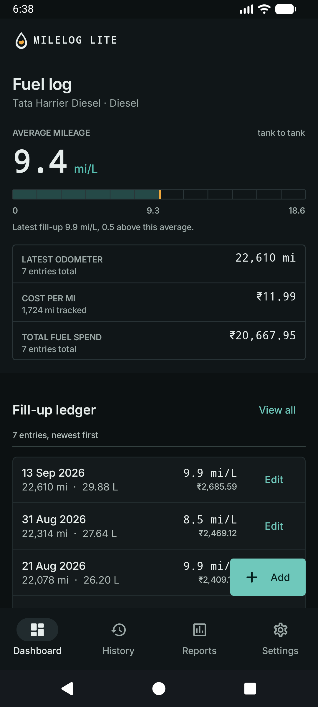
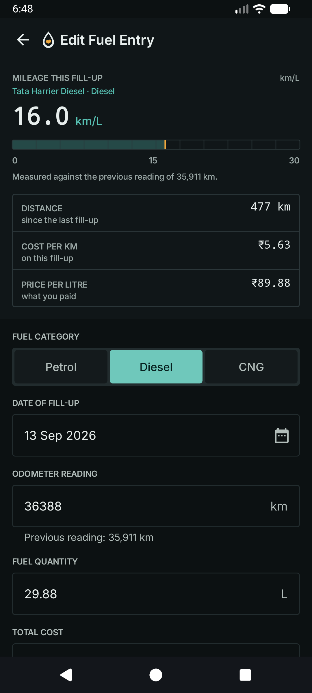
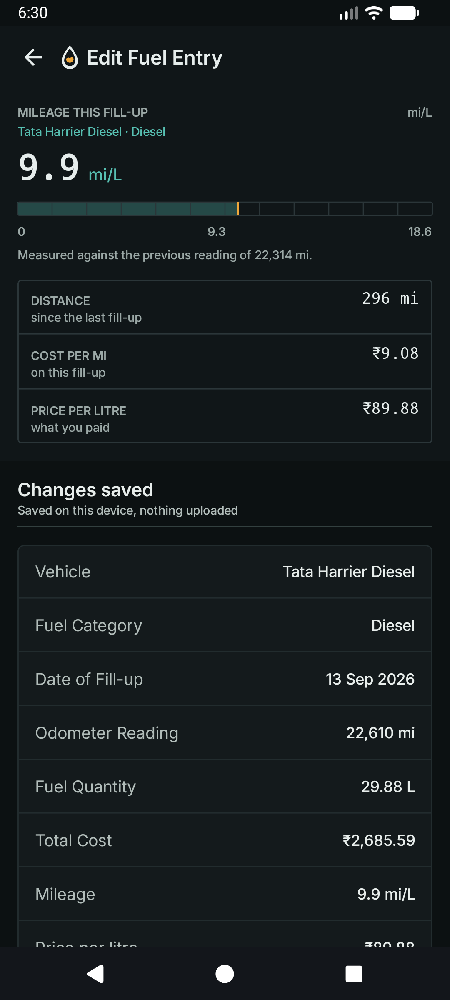
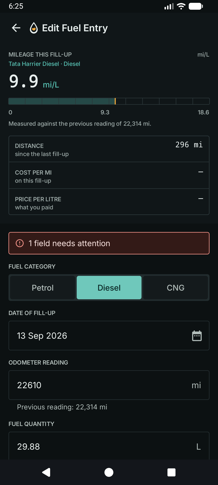
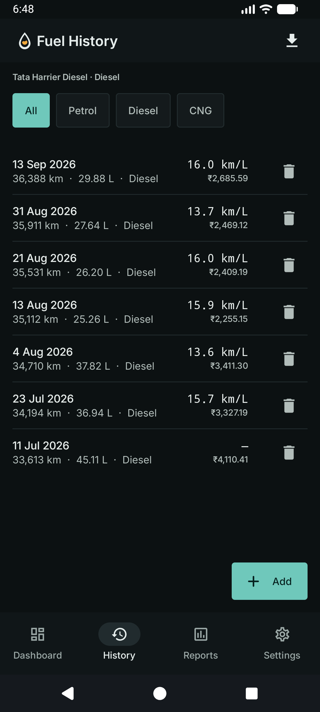
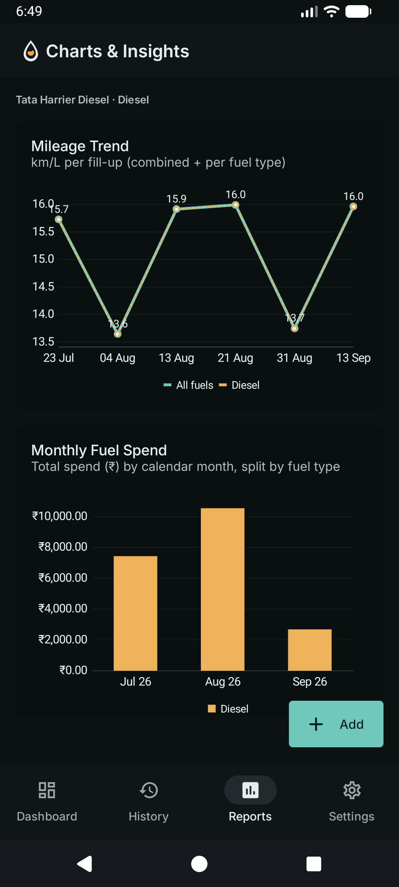
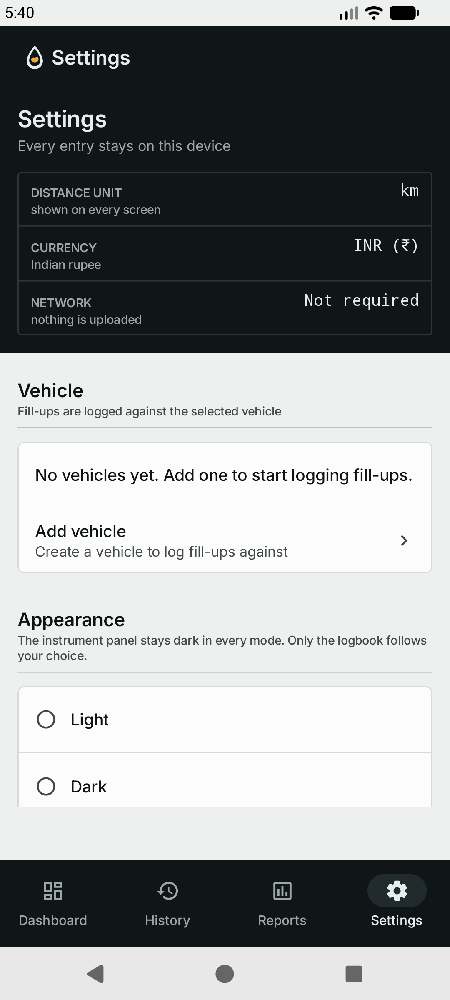
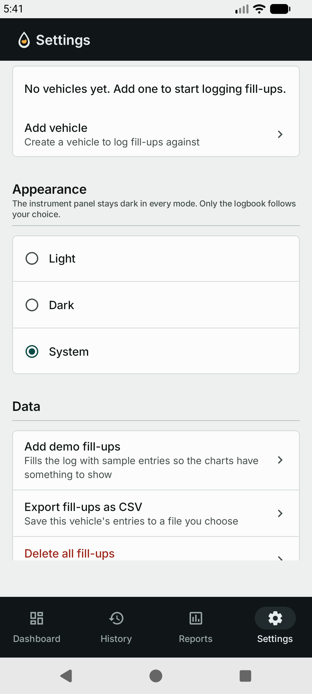
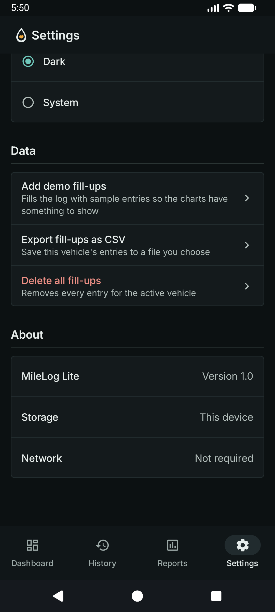

# MileLog Lite

MileLog Lite is a simple, offline-first Android app for logging fuel fill-ups and tracking mileage and spending. Log a fill-up in seconds, see your average mileage and cost per km automatically, and view trends over time - no internet needed.

Built with Kotlin, Jetpack Compose, Material 3, Room (local database), and MPAndroidChart.

---

## What you can do

- **Log fuel entries:** Add, edit, and delete fill-ups with date, odometer reading, fuel amount (liters), total cost, and fuel type.
- **Manage vehicles:** Add, edit, switch, and delete vehicles from Settings. Every fill-up belongs to a vehicle, and the dashboard, history, and charts follow the active selection.
- **Track by fuel type:** Choose Petrol, Diesel, or CNG for each entry, and filter your history by type.
- **Choose how the app looks:** Settings has a real Light / Dark / System control. The instrument panel stays dark in every mode; only the logbook follows your choice.
- **Choose your units:** Pick kilometres or miles. Odometer readings, distances, mileage (km/L or mi/L) and cost per km or mile all follow it, on the dashboard, the history, the charts and the entry form. Storage stays in kilometres.
- **See totals automatically:** Dashboard shows latest odometer, total spend, average mileage, and cost per km or mile. Values update as soon as you change an entry.
- **Edit from the dashboard:** Each row in the dashboard ledger carries an Edit link, so the first screen can change a fill-up without a detour through History.
- **Catch mistakes:** The form blocks missing fields, negative values, and odometer readings that don't go up. Invalid fields get an inline message, a banner counts them, and focus lands on the first one. Save is never disabled, so the reason is always visible.
- **See what you saved:** A valid save replaces the form with a summary of the record instead of dropping you straight back.
- **View trends:** Mileage trend line chart per fill-up, and monthly spend bar chart grouped by month, including per-category views.
- **Manage history:** List of all entries (newest first), tap to edit, delete with confirmation and undo.
- **Export:** Save your full history to a CSV file (`milelog_fuel_entries.csv`) via the system file picker.
- **Works offline:** All data stays on your device and persists after restart.

---

## Screens

| Screen            | What you'll see                                                                                                     | Key actions                              |
| ----------------- | ------------------------------------------------------------------------------------------------------------------- | ---------------------------------------- |
| Dashboard         | Instrument binnacle with the average mileage gauge, latest odometer, cost per km/mile and total spend, then the fill-up ledger (newest first) and the mileage trend. | Edit a fill-up, add entry, view history, open charts |
| Add / Edit Entry  | Fuel type, date, odometer (with the previous reading as context), litres and cost, plus a live instrument that reads as you type. A valid save shows a summary of what was recorded. | Pick date, choose category, save fill-up |
| Fuel History      | All entries newest-first with All / Petrol / Diesel / CNG filter chips.                                             | Tap to edit, delete (with undo), export CSV |
| Charts & Insights | Mileage trend and monthly spend charts. Friendly message when there are fewer than 2 entries.                       | View trend, view monthly spend           |
| Settings          | Configuration readout (distance unit, currency, network), vehicle list with active selection, appearance radio group, data actions and about rows. | Switch vehicle, change theme, export, clear with undo, add demo fill-ups |

---

## Getting started

**You need:**
- Android Studio Koala (2024.1.1) or newer
- JDK 17 (bundled with Android Studio is fine)
- Android SDK: Min API 26 (Android 8.0), Target API 36

**Run it:**

1. Clone and open the project:
   ```bash
   git clone https://github.com/byt-ctrl/MileLog-Lite.git
   cd MileLog-Lite/MileLog-Lite
   ```
   Then open the `MileLog-Lite` folder in Android Studio and press Run.

2. Or build from the command line (Windows):
   ```powershell
   .\gradlew.bat assembleDebug
   adb install -r app\build\outputs\apk\debug\app-debug.apk
   ```

3. To run tests:
   ```powershell
   .\gradlew.bat testDebugUnitTest          # 112 unit tests
   .\gradlew.bat connectedDebugAndroidTest  # 67 instrumented tests, needs a device
   ```

> Tip (Windows): set `$env:JAVA_HOME` to your JDK 17 path and `$env:ANDROID_HOME` to your SDK path if Gradle can't find Java or Android SDK.

> Tip (first run): Settings → **Add demo fill-ups** creates six vehicles (Creta, Seltos and Harrier, each in Diesel and CNG) with seven sample fill-ups each, so there is something to look at before you type anything.

---

## Limitations

- Vehicles are managed on-device only - there is no shared or cloud garage.
- Data lives only on the device - no cloud backup or sync.
- Export to CSV only - no import.
- Mileage assumes full-tank fill-ups between logs.
- Costs are shown in Indian Rupees (INR); the currency is not switchable.
- Distance units are kilometres or miles. Fuel stays in litres, so mileage reads as km/L or mi/L, not miles per gallon.
- Single language.

---

## Screenshots

<table>
  <tr>
    <td align="center"><b>Dashboard with fill-ups</b></td>
    <td align="center"><b>Log a fill-up</b></td>
    <td align="center"><b>Saved summary</b></td>
  </tr>
  <tr>
    <td></td>
    <td></td>
    <td></td>
  </tr>
  <tr>
    <td align="center"><b>Validation banner</b></td>
    <td align="center"><b>Fuel History</b></td>
    <td align="center"><b>Charts &amp; Insights</b></td>
  </tr>
  <tr>
    <td></td>
    <td></td>
    <td></td>
  </tr>
  <tr>
    <td align="center"><b>Settings: configuration</b></td>
    <td align="center"><b>Settings: appearance</b></td>
    <td align="center"><b>Settings: data and about</b></td>
  </tr>
  <tr>
    <td></td>
    <td></td>
    <td></td>
  </tr>
</table>

The dashboard shot is in miles and the form and history shots are in kilometres: the same demo log, read in both units, which is what the distance-unit setting changes.

---

## More docs

- [Project Documentation](docs/Project_Documentation_MileLog_Lite.md)
- [Product Requirements (PRD)](docs/PRD_MileLog_Lite.md)
- [Sprint Execution Plan](docs/Sprint_Plan_MileLog_Lite.md)
