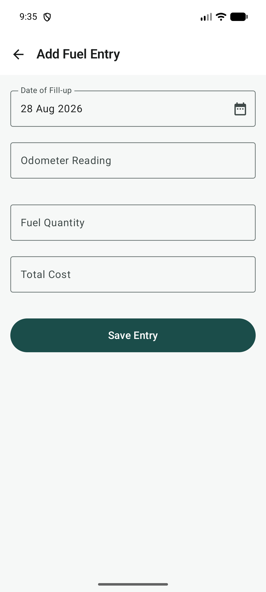
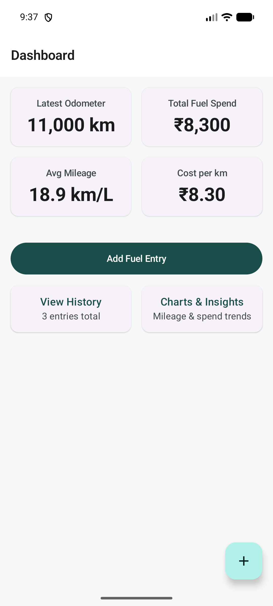
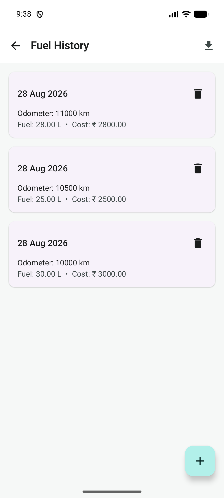
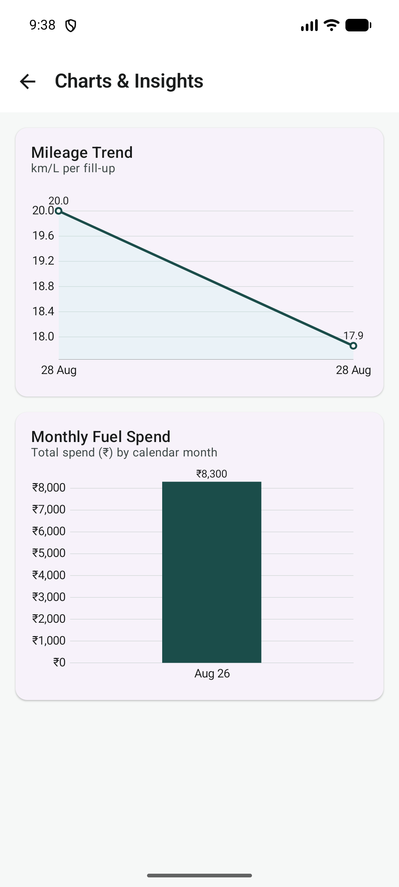
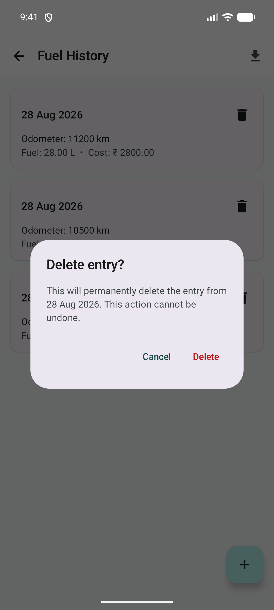

# MileLog Lite

MileLog Lite is a clean, offline-first Android application designed for quick fuel logging and real-time vehicle mileage analytics. Built with modern Android technologies (Kotlin, Jetpack Compose, Material Design 3, Room SQLite, and MPAndroidChart), it enables vehicle owners to log fill-ups in seconds and track fuel efficiency trends without requiring an internet connection.

---

## 1. Setup Instructions

### Prerequisites
- **Android Studio:** Koala (2024.1.1+) or newer
- **JDK:** Java 17 or higher (or the bundled Android Studio Java Runtime)
- **Android SDK:**
  - Minimum SDK: API 26 (Android 8.0 Oreo)
  - Target SDK: API 36
  - Compile SDK: API 37

### Environment Configuration
Ensure your environment variables are configured in your shell (PowerShell on Windows, or Bash/Zsh on macOS/Linux):

```powershell
# Set JAVA_HOME to your JDK 17 or Android Studio JBR path
$env:JAVA_HOME = "C:\Program Files\Android\Android Studio\jbr"

# Set ANDROID_HOME to your Android SDK installation directory
$env:ANDROID_HOME = "$env:LOCALAPPDATA\Android\Sdk"
$env:PATH += ";$env:ANDROID_HOME\platform-tools"
```

### Local Build and Run Steps

1. **Clone the repository:**
   ```bash
   git clone https://github.com/byt-ctrl/MileLog-Lite.git
   cd MileLog-Lite/MileLog-Lite
   ```

2. **Run Unit Tests:**
   ```powershell
   .\gradlew.bat testDebugUnitTest
   ```

3. **Run Device / Benchmark Tests:**
   ```powershell
   .\gradlew.bat connectedDebugAndroidTest
   ```

4. **Build the Debug APK:**
   ```powershell
   .\gradlew.bat assembleDebug
   ```

5. **Install on Device or Emulator:**
   ```powershell
   adb install -r app/build/outputs/apk/debug/app-debug.apk
   adb shell am start -n "com.example.myapplication/.MainActivity"
   ```

---

## 2. Feature List

- **Fast One-Tap Logging:** Quick-add action directly accessible from the dashboard and Floating Action Button (FAB) to log fill-ups in under 5 seconds.
- **Fuel Category Selection:** Categorize entries by fuel type (Petrol, Diesel, CNG) with a dropdown selector. Filter history and charts by category using filter chips.
- **Automated Calculations:**
  - **Per-Fillup Mileage:** Automatically computed as `(Current Odometer - Previous Odometer) / Fuel Quantity` (km/L).
  - **Average Mileage:** Running average calculated across all recorded fill-ups.
  - **Cost per Kilometer:** Operating expense ratio (`Total Fuel Spend / Total Distance Traveled`).
  - **Fleet Totals:** Running totals for distance traveled, fuel consumed, and overall expenditure.
  - **Per-Category Analytics:** Independent mileage averages and monthly spend breakdowns per fuel type.
- **Visual Analytics:**
  - **Mileage Trend Chart:** Chronological line graph visualizing fuel efficiency over successive fill-ups. Supports per-category overlay lines (dashed).
  - **Monthly Spend Chart:** Bar graph aggregating total fuel expenses grouped by calendar month. Supports grouped multi-series mode for per-category breakdown.
- **Smart Form Validation:** Real-time feedback preventing non-increasing odometer entries, negative fuel quantities, or missing cost values.
- **History Management:** Reverse-chronological log of all entries with category filter chips, one-tap editing, guarded deletion, and undo-on-delete via snackbar.
- **Offline-First Storage:** Local Room SQLite database with multi-column indices for fast query performance.
- **CSV Export:** One-tap export of the full fuel history (including fuel category) to a CSV file via the system document picker (no import/backup).
- **Dynamic Accessibility:** Fully responsive layout tested up to 200% system font scaling without text clipping or overlapping.

---

## 3. Core Screen Overview

| Screen | Description | Primary Actions |
|---|---|---|
| **Dashboard** | Displays summary metric cards (Latest Odometer, Total Spend, Avg Mileage, Cost/km) and quick-action navigation. | Add Fuel Entry, View History, Open Charts |
| **Add / Edit Entry** | Clean form interface for entering date, odometer, fuel volume (L), total cost (INR), and fuel category. | Date Picker, Category Dropdown, Inline Validation, Save / Update |
| **Fuel History** | Scrollable list of past fuel records with category filter chips. | Tap to Edit, Delete with Confirmation, Undo, CSV Export |
| **Charts & Insights** | Interactive visual charts showing mileage efficiency trends and monthly spend patterns. | View Line Trend, View Monthly Spend Bars, Per-Category Overlay |

### Visual Layout Guide

- **Dashboard Screen:**
  - *Summary Metrics:* 2x2 grid displaying Latest Odometer (with fuel category), Total Fuel Spend, Average Mileage, and Cost per km.
  - *Action Area:* Primary "Add Fuel Entry" button, "View History" tile, and "Charts & Insights" tile.
  - *Empty State:* Displayed when zero entries exist, prompting the user to add their first record.

- **Add / Edit Fuel Entry Screen:**
  - *Input Controls:* Date selector modal, numeric inputs for odometer, fuel quantity, total cost, and fuel category dropdown (Petrol/Diesel/CNG).
  - *Validation:* Contextual helper text and inline red error states.

- **Fuel History Screen:**
  - *Category Filter:* Horizontal chip row for All / Petrol / Diesel / CNG filtering.
  - *Record List:* Elevated cards with fill-up date, odometer reading, liters, total cost, and computed mileage badge.
  - *Management:* Tap to edit, trash icon to delete with confirmation dialog and undo snackbar.

- **Charts & Insights Screen:**
  - *Line Chart:* Mileage (km/L) per fill-up plotted chronologically with per-category overlay support.
  - *Bar Chart:* Total monthly fuel expenditure (INR) grouped by calendar month with multi-series category breakdown.

---

## 4. Technical Specifications

| Component | Technology | Role |
|---|---|---|
| Language | Kotlin 2.2.10 | Core application language |
| UI Framework | Jetpack Compose (Material 3) | Declarative UI and dynamic theme styling |
| State Management | StateFlow & ViewModel | Reactive unidirectional data flow |
| Local Database | Room 2.8.4 (SQLite) | Indexed offline data persistence |
| Charting Library | MPAndroidChart v3.1.0 | Line and bar visualization rendering |
| Navigation | Navigation Compose 2.9.8 | Type-safe screen routing |
| Unit Testing | JUnit 4.13.2 | Calculation and validator test suites |

### Architecture

```
UI (Compose Screens) → ViewModel (StateFlow) → Repository → DAO (Room) → SQLite
                          ↓
                    Domain Logic (Pure Kotlin)
                    MileageCalculator / FuelEntryValidator / CsvExporter
```

### Package Structure

```
com.example.myapplication/
├── MainActivity.kt
├── MileLogApplication.kt
├── data/
│   ├── local/
│   │   ├── FuelCategory.kt          # Enum: PETROL, DIESEL, CNG
│   │   ├── FuelEntry.kt             # Room @Entity with indexes
│   │   ├── FuelEntryDao.kt          # Room @Dao (11 methods)
│   │   └── MileLiteDatabase.kt      # Room Database (v2)
│   └── repository/
│       └── FuelEntryRepository.kt   # Interface + OfflineRepository
├── domain/
│   ├── calculation/
│   │   └── MileageCalculator.kt     # Pure-Kotlin calculation engine
│   ├── export/
│   │   └── FuelEntryCsvExporter.kt  # Pure-Kotlin CSV builder
│   └── validation/
│       └── FuelEntryValidator.kt    # Validation rules
└── ui/
    ├── charts/                      # ChartsScreen, MileageTrendChart, MonthlySpendChart
    ├── dashboard/                   # DashboardScreen, DashboardViewModel
    ├── entry/                       # AddEditEntryScreen, AddEditViewModel
    ├── history/                     # HistoryScreen, HistoryViewModel
    ├── navigation/                  # MileLiteNavHost (5 routes)
    └── theme/                       # Color.kt, Type.kt, Theme.kt
```

---

## 5. Testing

| Category | Files | Test Methods |
|---|---|---|
| Unit Tests | 5 | 42 |
| Instrumented Tests | 6 | 38 |
| **Total** | **11** | **80** |

### Key Test Coverage
- **Validator:** Empty inputs, odometer monotonicity, negative/zero values
- **Calculator:** Empty/single/multi entry, same-odometer edge, monthly spend grouping, per-category mileage and monthly spend
- **CSV Export:** Empty list, single/multiple entries, fuel category column, default category
- **Fuel Category:** Enum integrity, fromDisplayName, filtering logic, large dataset (10k entries)
- **DAO:** CRUD operations, Flow reactivity, category filtering, bulk insert, performance benchmarks (5000 entries)
- **Regression:** Full CRUD flow, edit/delete impact on dashboard/charts, category-aware operations

---

## 6. Known Limitations

1. **Single Vehicle Tracking:** Designed for single-vehicle tracking per installation (multi-vehicle profiles are not included in the lite scope).
2. **Local Storage Only:** Data is stored strictly on the local device; cloud backup and multi-device synchronization are not included.
3. **Export Only, No Import:** Fuel history can be exported to CSV via the system document picker, but CSV import/restore is not supported.
4. **Full-Tank Assumption:** Mileage calculations assume complete fill-ups between consecutive logs.
5. **Single Currency:** Currency values are formatted in Indian Rupees (INR); dynamic multi-currency switching is not configured.
6. **Destructive Migration:** Database uses `fallbackToDestructiveMigration()` which drops all tables on version bump.

---

## 7. Screenshots

<table>
  <tr>
    <td align="center"><b>Empty Dashboard</b></td>
    <td align="center"><b>Add Entry Form</b></td>
    <td align="center"><b>Dashboard with Data</b></td>
  </tr>
  <tr>
    <td></td>
    <td></td>
    <td></td>
  </tr>
  <tr>
    <td align="center"><b>Fuel History</b></td>
    <td align="center"><b>Charts & Insights</b></td>
    <td align="center"><b>Delete Confirmation</b></td>
  </tr>
  <tr>
    <td></td>
    <td></td>
    <td></td>
  </tr>
</table>

---

## Documentation Links

- [Complete Project Documentation](docs/Project_Documentation_MileLog_Lite.md)
- [Product Requirements Document (PRD)](docs/PRD_MileLog_Lite.md)
- [Sprint Execution Plan](docs/Sprint_Plan_MileLog_Lite.md)
