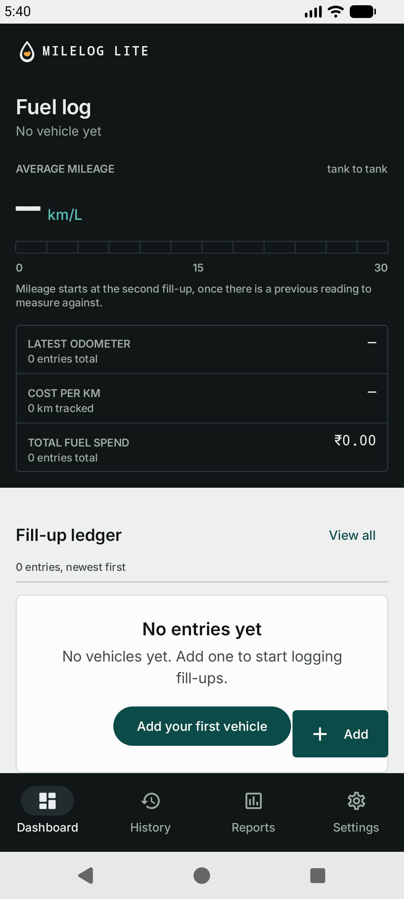

# MileLog Lite - Technical Project Documentation

MileLog Lite is a lightweight, offline-first Android application designed for streamlined fuel logging, automatic mileage calculations, and visual cost analytics. This document provides a complete technical guide for developers, reviewers, and maintainers.

---

## 1. Setup and Installation Guide

### 1.1 Development Prerequisites
Ensure your development environment meets the following specifications:
- **Operating System:** Windows 10/11, macOS (12+), or Linux (Ubuntu 20.04+)
- **Integrated Development Environment:** Android Studio Koala (2024.1.1+) or newer
- **Java Development Kit:** JDK 17 (recommended: Android Studio bundled JBR 17 or Eclipse Temurin JDK 17)
- **Android SDK Targets:**
  - Minimum SDK: API 26 (Android 8.0 Oreo)
  - Target SDK: API 36
  - Compile SDK: API 37
  - Android Build Tools and Platform-Tools (`adb`)

### 1.2 Environment Variables
Configure your system environment variables before building from the command line:

```powershell
# Point JAVA_HOME to your JDK 17 or Android Studio JBR installation
$env:JAVA_HOME = "C:\Program Files\Android\Android Studio\jbr"

# Point ANDROID_HOME to your Android SDK installation directory
$env:ANDROID_HOME = "$env:LOCALAPPDATA\Android\Sdk"
$env:PATH += ";$env:ANDROID_HOME\platform-tools"
```

### 1.3 Project Setup & Repository Cloning
```bash
git clone https://github.com/byt-ctrl/MileLog-Lite.git
cd MileLog-Lite/MileLog-Lite
```

### 1.4 Command-Line Execution Reference

| Action | Command | Expected Output |
|---|---|---|
| **Unit Tests** | `.\gradlew.bat testDebugUnitTest` | 112 tests: calculations, validators, CSV export, preferences, units, theme resolution |
| **Instrumented Tests** | `.\gradlew.bat connectedDebugAndroidTest` | 67 tests on a booted device/emulator: DAO, migrations, repositories, preferences on disk |
| **Debug Build** | `.\gradlew.bat assembleDebug` | Produces `app-debug.apk` in `app/build/outputs/apk/debug/` |
| **Install & Launch** | `adb install -r app/build/outputs/apk/debug/app-debug.apk`<br>`adb shell am start -n "com.example.myapplication/.MainActivity"` | Installs and opens the application on device |

---

## 2. Feature Specification

### 2.1 Core Capabilities
- **Fast Fill-up Logging:** Complete a new log from the shell's Floating Action Button on Dashboard, History or Reports (or the rail action on expanded windows). The sheet reads in the order the entry is decided: fuel type, date, odometer, litres, cost.
- **Fuel Category Selection:** Categorize entries by fuel type (Petrol, Diesel, CNG) with a segmented radio group in the add/edit form. Filter history by category using filter chips, and read per-category charts.
- **Appearance:** A Light / Dark / System radio group in Settings. The instrument panel (top bar, rail, bottom bar, binnacle) stays dark in every mode; only the logbook follows the choice. Applied by recomposition, no restart.
- **Distance Unit:** Kilometres or miles, set from the vehicle form and stated in the Settings readout. Every odometer, distance, mileage and cost-per-distance readout converts, including the entry form's odometer field and the charts' axes. **Storage and all calculations stay in kilometres**; conversion is display-only (`DistanceConverter`).
- **Multi-Vehicle:** Add, edit, switch and delete vehicles from Settings. Every fill-up belongs to a vehicle, and Dashboard, History, Charts and the entry form all follow the active selection.
- **Automated Calculations:**
  - **Per-Fillup Fuel Economy:** `(Current Odometer - Previous Odometer) / Fuel Volume` (km/L).
  - **Running Average Mileage:** `Total Distance / Total Fuel excluding the baseline fill-up`.
  - **Cost per Distance:** `Total Cost / Total Distance`.
  - **Summary Metrics:** Total expenditure, total litres, latest odometer reading, latest fuel category.
  - **Per-Category Analytics:** Independent mileage series and monthly spend breakdowns per fuel type.
- **Visual Trend Analytics:**
  - **Mileage Trend Line Chart:** Chronological plot of fuel economy per fill-up, combined plus dashed per-category overlays.
  - **Monthly Spend Bar Chart:** Total fuel cost grouped by calendar month, single-series or grouped per category.
  - **Empty / Single-Entry States:** Contextual fallback views when there are fewer than two records.
- **Full History Management:**
  - Reverse-chronological ledger (newest first), figures right-aligned so columns compare vertically.
  - Category filter chips (All / Petrol / Diesel / CNG).
  - Tap a row to edit; the dashboard ledger carries an Edit link per row.
  - Guarded deletion requiring explicit confirmation, with undo via snackbar.
- **Input Validation Rules:**
  - Rejects odometer readings equal to or lower than the previous reading for the vehicle.
  - Rejects zero or negative fuel volume and total cost.
  - Inline message under each invalid field, a banner counting them (`%d fields need attention`), and focus moved to the first invalid field. Save is never disabled.
- **Post-Save Summary:** A valid save replaces the form with a readout of what was recorded (vehicle, category, date, odometer, litres, cost, measured mileage, price per litre) rather than navigating straight back.
- **Offline Persistence:**
  - Room SQLite with indices on `date`, `odometer`, composite `(date, odometer)`, `fuelCategory`, and `vehicleId`.
  - Foreign key from `fuel_entries.vehicleId` to `vehicles.id` with `ON DELETE CASCADE`.
- **Preferences:** `theme_mode` and `distance_unit` in `SharedPreferences("milelog_prefs")`, written with `commit()` so they survive the process that set them.
- **CSV Export:**
  - One-tap export of the active vehicle's fuel history to `milelog_fuel_entries.csv` (`id,date,vehicle,odometer,liters,cost,mileage,fuel_category`) via the system document picker (SAF). Export-only — no import or backup/restore.
  - Dates are ISO-8601 (`yyyy-MM-dd`), numbers use fixed decimals with a dot separator, mileage is recomputed with the same calculator the dashboard uses (blank for the baseline fill-up), rows are chronological, and the file is UTF-8 with a BOM. Columns stay in kilometres, matching storage.
- **Demo Data:** Settings → Add demo fill-ups creates six vehicles (Creta, Seltos, Harrier — each Diesel and CNG) with seven sample fill-ups each, appended after any existing readings.
- **Accessibility:** Content descriptions on interactive elements, 48dp minimum touch targets, live-region validation notices, and layouts that tolerate large system font scale.

---

## 3. Core Screen Overview

Every screen adapts from its **own** frame (`BoxWithConstraints`), never the window: once the shell's 228dp rail is on screen it has already taken that width out of the content, so a window-width threshold would misfire and split a tablet into two unreadable columns. Logbook content is capped at `MileLogWindow.contentMaxWidth` and centred by the shared `LogbookContent` frame; instrument bands stay full-bleed, because the dark casing has to reach the window edges. Readout-strip density scales with the system font size, not width alone.

### 3.1 Dashboard Screen (`DashboardScreen.kt`)
- **Purpose:** Monitor surface, read in the order a driver checks it: gauge, readouts, record.
- **UI Structure:**
  - *Binnacle (instrument band):* average mileage gauge on a real 0–30 km/L scale (0–18.6 mi/L in miles) with ticks and an amber marker, plus a readout strip of latest odometer, cost per km/mile and total spend.
  - *Fill-up ledger:* ruled table, newest first — date, odometer, litres, mileage, cost and an Edit link per row. Below 600dp each row stacks into two lines; at and above it the columns are captioned and aligned.
  - *Mileage by fill-up:* one bar per measured fill-up on a zero-based scale with the value and signed delta printed under each bar.
  - *Empty / Error States:* prompt to add a vehicle or the first entry; retry-enabled error block.

### 3.2 Add / Edit Fuel Entry Screen (`AddEditEntryScreen.kt`)
- **Purpose:** Operate surface where the instrument becomes the input display.
- **UI Structure:**
  - *Instrument band:* live mileage on the same gauge scale as the dashboard, plus distance since the last fill-up, cost per km/mile and price per litre. A missing or low odometer leaves the dial at zero and the readouts at `—`.
  - *Entry sheet:* fuel type (segmented radio group) → date → odometer (previous reading as helper text and validation context) → litres → cost.
  - *Validation:* inline messages, the counting banner, focus moved to the first invalid field; save stays enabled.
  - *Commit:* "Save fill-up" / "Save changes" with "Saved on this device, nothing uploaded" beside it.
  - *Saved summary:* replaces the sheet after a successful write, with a Done action.
  - *One scroll context:* the instrument readings and the sheet scroll together in a single container that also carries `imePadding()` and `imeNestedScroll()`, so opening the keyboard shortens and scrolls the whole page instead of only the form (the readings never stay pinned while the fields move under them). A Material 3 date picker dialog handles the date.
  - *Wide content:* at `MileLogWindow.wide` (720dp of content) the sheet recomposes into the console layout the design describes, the live instrument beside the fields; below it the instrument stays full-bleed and the form is capped and centred by `LogbookContent`.

### 3.3 Fuel History Screen (`HistoryScreen.kt`)
- **Purpose:** Chronological ledger of the active vehicle's fill-ups with category filtering.
- **UI Structure:**
  - *Category Filter Chips:* horizontally scrollable row ("All" plus one chip per `FuelCategory`).
  - *Ledger Rows:* date, odometer, litres (+ category on phones), mileage and cost; the baseline entry has no mileage and shows `—`.
  - *Edit Action:* tapping a row opens the entry in edit mode.
  - *Delete Action:* per-row delete opening a modal confirmation, with an undo snackbar afterwards.
  - *CSV Export:* top-bar action triggering the system document picker, reporting how many entries were written.
  - *Floating Action Button:* fixed bottom-right button to add a new entry.

### 3.4 Charts & Insights Screen (`ChartsScreen.kt`)
- **Purpose:** Visual analytics for fuel economy and spend patterns.
- **UI Structure:**
  - *Mileage Trend Card:* line chart of mileage per fill-up, drawn in the selected unit. A neutral combined "All fuels" line plus dashed per-category overlays, straight segments (a curve would invent readings between fill-ups). Each fuel type has its own stable colour (petrol / diesel / CNG) so a category is never mistaken for the total.
  - *Monthly Spend Card:* bar chart of total cost per calendar month, single-series or grouped per category.
  - *Tap readout:* tapping a bar or a line point opens a marker tooltip showing the exact value for that highlight (month + cost, or date + mileage), plus the series name when the chart is split by fuel type.
  - *Layout:* plots stack below 720dp of content width and sit side by side above it.
  - *Fallback / Error States:* friendly notice under two entries; retry-enabled error block.

### 3.5 Vehicles Screen (`VehiclesScreen.kt`)
- **Purpose:** The garage. Selecting the vehicle every fill-up lands against is a primary navigation destination, not a settings detail.
- **UI Structure:**
  - *Configuration readout:* the active vehicle and how many vehicles are on the device.
  - *Vehicle list:* one row per vehicle with a radio for the active selection, an edit action, and a delete action with a confirmation dialog plus an undo-style snackbar message.
  - *Add vehicle row:* opens the add-vehicle form.

### 3.6 Settings Screen (`SettingsScreen.kt`)
- **Purpose:** Configure surface. It opens with the current configuration as an instrument readout rather than a decorative header.
- **UI Structure:**
  - *Configuration readout:* distance unit, currency, network (nothing is uploaded).
  - *Appearance group:* Light / Dark / System radio group with the note that the instrument stays dark in every mode.
  - *Data group:* Add demo fill-ups, Export fill-ups as CSV, Delete all fill-ups (confirmation and undo).
  - *About group:* version, storage ("This device"), network ("Not required").
- **Note:** vehicle management moved to its own `Vehicles` destination; Settings keeps the active-vehicle flow only to scope the entry count it offers to clear.

### 3.7 Add / Edit Vehicle Screen (`AddEditVehicleScreen.kt`)
- **Purpose:** Configure a vehicle: name, make, model, optional registration, default fuel type, and the distance unit.
- **Note:** the distance unit is an install-wide preference, so it writes as it is picked while the rest of the form saves on submit.
- **Wide content:** the preview and the fields split side by side at `MileLogWindow.wide`, matching the entry sheet, and share the same single scroll context under the keyboard.

---

## 4. Technical Architecture

### 4.1 Architecture Pattern
The application follows **MVVM + Repository** architecture with unidirectional data flow:

```
UI (Compose Screens) → ViewModel (StateFlow) → Repository → DAO (Room) → SQLite
                          ↓
                    Domain Logic (Pure Kotlin)
                    MileageCalculator / FuelEntryValidator / VehicleValidator
                    FuelEntryCsvExporter / DistanceConverter / DemoDataGenerator
```

### 4.2 Package Structure

```
com.example.myapplication/
├── MainActivity.kt                    # Entry point, edge-to-edge, collects themeMode, applies MileLogTheme
├── MileLogApplication.kt              # Application subclass, manual DI root
│
├── data/
│   ├── local/
│   │   ├── FuelCategory.kt            # Enum: PETROL, DIESEL, CNG (+ FuelCategoryConverters)
│   │   ├── FuelEntry.kt               # Room @Entity with indices and vehicle FK
│   │   ├── FuelEntryDao.kt            # Room @Dao, vehicle-scoped and category-scoped queries
│   │   ├── MileLiteDatabase.kt        # Room Database (v4) + migrations + single-active repair
│   │   ├── ThemeMode.kt               # Enum: LIGHT, DARK, SYSTEM + isDark resolution
│   │   ├── UserPreferences.kt         # PreferencesStorage seam + typed preference access
│   │   └── Vehicle.kt                 # Room @Entity, unique name, active flag
│   └── repository/
│       ├── FuelEntryRepository.kt     # Interface + OfflineFuelEntryRepository
│       ├── SettingsRepository.kt      # Interface + OfflineSettingsRepository (StateFlow)
│       └── VehicleRepository.kt       # Interface + OfflineVehicleRepository
│
├── domain/
│   ├── calculation/
│   │   └── MileageCalculator.kt       # DashboardStats, FillupMileage, MonthlySpend, per-category series
│   ├── conversion/
│   │   ├── DistanceConverter.kt       # kmToMiles, toKilometres, convertMileage, formatDistance
│   │   └── DistanceUnit.kt            # Enum: KILOMETERS, MILES
│   ├── demo/
│   │   └── DemoDataGenerator.kt       # Six demo profiles and their histories
│   ├── export/
│   │   └── FuelEntryCsvExporter.kt    # Pure-Kotlin CSV builder
│   └── validation/
│       ├── FuelEntryValidator.kt      # FieldError, ValidationResult, validate()
│       └── VehicleValidator.kt        # VehicleFieldError, required and duplicate names
│
└── ui/
    ├── charts/
    │   ├── ChartsScreen.kt            # Charts & Insights screen
    │   ├── ChartsViewModel.kt         # Chart data computation
    │   ├── MileageTrendChart.kt       # MPAndroidChart LineChart wrapper
    │   └── MonthlySpendChart.kt       # MPAndroidChart BarChart wrapper
    ├── components/
    │   ├── InstrumentChrome.kt        # InstrumentBar, wordmark, product mark
    │   ├── InstrumentReadouts.kt      # MileageGauge, GaugeScaleLabels, ReadoutStrip
    │   ├── Ledger.kt                  # LedgerPanel, SectionHeader, LedgerRow, MileageTrendBars
    │   ├── DistanceText.kt            # Unit-aware copy: formatDistanceWithUnit, formatMileageWithUnit
    │   ├── SegmentedChoice.kt         # Shared segmented radio group
    │   └── MileLogFab.kt              # Shell primary action
    ├── dashboard/
    │   ├── DashboardScreen.kt         # Binnacle + ledger with edit links + trend
    │   └── DashboardViewModel.kt      # Dashboard state management
    ├── entry/
    │   ├── AddEditEntryScreen.kt      # Live instrument, ordered sheet, validation, saved summary
    │   └── AddEditViewModel.kt        # Form state, validation, unit conversion, save
    ├── history/
    │   ├── HistoryScreen.kt           # Filtered ledger, delete, undo, CSV export
    │   └── HistoryViewModel.kt        # Category filter, delete+undo, export
    ├── navigation/
    │   ├── MileLiteNavHost.kt         # Routes + NavHost + shell layout composition local
    │   └── BottomNavBar.kt            # MileLogBottomBar (compact) and MileLogRail (expanded)
    ├── settings/
    │   ├── SettingsScreen.kt          # Configuration readout, vehicle/appearance/data/about groups
    │   └── SettingsViewModel.kt       # Vehicles, theme, export, clear+undo, demo seed
    ├── vehicle/
    │   ├── AddEditVehicleScreen.kt    # Vehicle form incl. the distance unit control
    │   └── AddEditVehicleViewModel.kt # Vehicle form state and validation
    └── theme/
        ├── Color.kt                   # Instrument Ledger palette + LedgerColors
        ├── Theme.kt                   # MileLogTheme(themeMode), dynamic color OFF
        ├── Type.kt                    # Inter typography + DataMono / DataTextStyle
        ├── Spacing.kt                 # Spacing scale, touch targets, window breakpoints
        ├── Shape.kt                   # Small radii + M3 mapping
        └── Elevation.kt               # Tonal material change (level1/2 shadows are no-ops)
```

### 4.3 Layer Responsibilities

| Layer | Primary Components | Responsibility |
|---|---|---|
| **Presentation (UI)** | Jetpack Compose, Material Design 3 | Declarative screen layouts, instrument/logbook materials, unit-aware copy |
| **State Management** | ViewModels, StateFlow, Coroutines | Immutable UI states, user actions, preference + database flow combination |
| **Domain Logic** | `MileageCalculator`, validators, `FuelEntryCsvExporter`, `DistanceConverter`, `DemoDataGenerator` | Pure Kotlin business logic, validation, conversion, CSV generation |
| **Data & Persistence** | Room, SQLite, repositories, `UserPreferences` | Indexed queries, transactional operations, preference persistence |
| **Visualization** | MPAndroidChart via Compose `AndroidView` | Native line and bar rendering with per-category overlays |

---

## 5. Data Model

### 5.1 Entity: `FuelEntry`

| Column | Type | Constraints | Description |
|---|---|---|---|
| `id` | `Long` | `@PrimaryKey(autoGenerate = true)` | Auto-generated unique identifier |
| `vehicleId` | `Long?` | FK → `vehicles.id`, `ON DELETE CASCADE`, indexed | Owning vehicle; null only for an entry whose vehicle was removed |
| `date` | `Long` | NOT NULL | Epoch timestamp in milliseconds |
| `odometer` | `Int` | NOT NULL | Vehicle odometer reading **in km** |
| `liters` | `Double` | NOT NULL | Fuel volume in litres |
| `cost` | `Double` | NOT NULL | Total cost in INR |
| `fuelCategory` | `String` | NOT NULL, default `"Petrol"` | Fuel type display name |

### 5.2 Entity: `Vehicle`

| Column | Type | Constraints | Description |
|---|---|---|---|
| `id` | `Long` | `@PrimaryKey(autoGenerate = true)` | Auto-generated unique identifier |
| `name` | `String` | unique index | Display name, e.g. "Hyundai Creta" |
| `make` | `String` | default `""` | Manufacturer |
| `model` | `String` | default `""` | Model line |
| `registrationNumber` | `String` | default `""` | Optional registration plate |
| `fuelType` | `String` | default `"Petrol"` | Default fuel category for new entries |
| `isActive` | `Boolean` | default `false` | The single vehicle currently selected |

### 5.3 Database Indexes
1. `Index(value = ["date"])` — date-based queries and sorting
2. `Index(value = ["odometer"])` — odometer-based lookups
3. `Index(value = ["date", "odometer"])` — composite index for combined queries
4. `Index(value = ["fuelCategory"])` — category filter queries
5. `Index(value = ["vehicleId"])` — per-vehicle scoping
6. `Index(value = ["name"], unique = true)` on `vehicles`

### 5.4 FuelCategory Enum

| Value | Display Name | Description |
|---|---|---|
| `PETROL` | "Petrol" | Default fuel type |
| `DIESEL` | "Diesel" | Diesel fuel |
| `CNG` | "CNG" | Compressed Natural Gas |

### 5.5 Database Configuration
- **Version:** 4, named `milelog_lite.db`
- **Export Schema:** `true`, written to `app/schemas` and exposed to instrumented tests
- **Migrations:** `MIGRATION_1_2` (fuel category), `MIGRATION_2_3` (vehicles, `vehicleId`, existing rows filed under a default vehicle), `MIGRATION_3_4` (nullable `vehicleId` + FK cascade, table rebuild)
- **Fallback:** `fallbackToDestructiveMigrationOnDowngrade` only — a missing upgrade path fails loudly rather than wiping data
- **Invariant repair:** `REPAIR_ACTIVE_VEHICLE` runs on every open so exactly one vehicle is active
- **Backup:** the database is excluded from cloud backup (device-to-device transfer retained)

### 5.6 Preferences

| Key | Values | Default |
|---|---|---|
| `theme_mode` | `"light"`, `"dark"`, `"system"` | `"system"` |
| `distance_unit` | `"km"`, `"mi"` | `"km"` |

Stored in `SharedPreferences("milelog_prefs")` through `SharedPreferencesStorage` (a `commit()` on `Dispatchers.IO`) and exposed as `StateFlow`s by `OfflineSettingsRepository`.

---

## 6. Dependencies

### 6.1 Core Dependencies

| Library | Version | Purpose |
|---|---|---|
| Kotlin | 2.2.10 | Core language |
| Compose BOM | 2026.02.01 | UI toolkit |
| Material 3 | (BOM-managed) | Design system |
| Material Icons Extended | (BOM-managed) | Icon set |
| Room | 2.8.4 | Local database |
| Navigation Compose | 2.9.8 | Screen navigation |
| Lifecycle ViewModel Compose | 2.11.0 | ViewModel integration |
| MPAndroidChart | v3.1.0 | Line and bar charts |
| Core KTX | 1.19.0 | Kotlin extensions |
| Activity Compose | 1.13.0 | Activity integration, `enableEdgeToEdge` |

### 6.2 Testing Dependencies

| Library | Version | Purpose |
|---|---|---|
| JUnit 4 | 4.13.2 | Unit testing |
| AndroidX JUnit | 1.3.0 | Instrumented testing |
| Espresso Core | 3.7.0 | UI testing |
| Compose UI Test JUnit4 | (BOM-managed) | Compose testing |
| Room Testing | 2.8.4 | Database and migration testing |

### 6.3 Build Configuration

| Setting | Value |
|---|---|
| AGP | 9.2.1 |
| KSP | 2.3.11 |
| Min SDK | 26 |
| Target SDK | 36 |
| Compile SDK | 37 |
| Gradle | 9.4.1 |
| Java Compatibility | VERSION_11 |
| Namespace | com.example.myapplication |

---

## 7. Navigation

### 7.1 Routes

| Route | Constant | Composable | Arguments |
|---|---|---|---|
| `"dashboard"` | `DASHBOARD` | `DashboardScreen` | None (start destination) |
| `"history"` | `HISTORY` | `HistoryScreen` | None |
| `"charts"` | `CHARTS` (`REPORTS`) | `ChartsScreen` | None |
| `"vehicles"` | `VEHICLES` | `VehiclesScreen` | None |
| `"settings"` | `SETTINGS` | `SettingsScreen` | None |
| `"add_entry"` | `ADD_ENTRY` | `AddEditEntryScreen(entryId = 0L)` | None |
| `"edit_entry/{entryId}"` | `EDIT_ENTRY` | `AddEditEntryScreen(entryId)` | `entryId: Long` |
| `"vehicle_add"` | `VEHICLE_ADD` | `AddEditVehicleScreen(vehicleId = 0L)` | None |
| `"vehicle_edit/{vehicleId}"` | `VEHICLE_EDIT` | `AddEditVehicleScreen(vehicleId)` | `vehicleId: Long` |

### 7.2 Shell
- Below 840dp the shell is a dark bottom bar with five destinations (Dashboard, History, Reports, Vehicles, Settings) plus the primary-action FAB on everything except Settings and Vehicles.
- At and above 840dp it is a dark 228dp rail carrying the same destinations, the wordmark, the primary action and the offline note.
- Destination changes cross-fade with a short directional offset; a tab press pops up to the start destination and restores state; back from a tab pops to the start destination.
- `AddEditEntryScreen` and `AddEditVehicleScreen` are full-screen routes with no shell bars.

### 7.3 Navigation Flow
- **Dashboard** → Add Entry (FAB), History ("View all"), Charts ("Open charts"), Edit Entry (ledger row link), Add Vehicle (empty state)
- **History** → Edit Entry (tap row), Add Entry (FAB), Delete Entry (row action + confirmation + undo), Export CSV (top bar)
- **Charts** → Add Entry (empty state CTA)
- **Vehicles** → Add Vehicle, Edit Vehicle, switch active vehicle, delete vehicle (confirmation)
- **Settings** → export, clear with undo, seed demo data, appearance, distance unit
- **Add/Edit** → back arrow, or Done after a save

---

## 8. Theme System

### 8.1 Instrument Ledger

Two materials, one object. The top of every screen is a permanently dark instrument binnacle; below it the surface is a light logbook. Depth comes from the material change, not from shadow.

| Token group | Light | Dark |
|---|---|---|
| Logbook paper (`background`) | `#EDF0EF` | `#0C1112` |
| Logbook panel (`surface`) | `#FBFCFB` | `#141A1C` |
| Ink (`onSurface`) | `#0E1413` | `#E7EDEB` |
| Primary (petrol) | `#0B4A46` | `#6FC8BB` |
| Secondary (fuel) | `#8A5200` | `#EDB25A` |
| Rule / rule strong | `#D5DBD9` / `#B9C2BF` | `#222C2E` / `#33403F` |

The instrument roles are **identical in both appearances** and travel through `LocalLedgerColors`, not the Material scheme: surface `#101618`, raised `#182023`, rule `#2B3639`, text `#E6EDEC`, muted `#9BA8A6`, readout `#57C0B2`, marker `#F0A83C`.

**Design Decision:** Dynamic color is intentionally disabled, so the identity is identical on every device.

### 8.2 Appearance Preference
`MileLogTheme(themeMode)` resolves `ThemeMode.SYSTEM → isSystemInDarkTheme()`, `LIGHT → false`, `DARK → true`. `MainActivity` collects `SettingsRepository.themeMode` and re-applies `enableEdgeToEdge` from a `LaunchedEffect(darkTheme)`, so the logbook, the system-bar icon contrast and everything below recompose on change without a restart. The instrument never flips.

### 8.3 Typography

Inter for prose, `DataMono` for readings. The classes that matter:

| Style | Family | Weight | Size (sp) | Notes |
|---|---|---|---|---|
| displayLarge / displayMedium | Inter | SemiBold | 48 / 36 | Gauge value |
| headlineMedium | Inter | SemiBold | 24 | Binnacle title |
| titleLarge | Inter | SemiBold | 20 | Section headers |
| titleMedium | Inter | Medium | 16 | Row titles |
| bodyMedium / bodySmall | Inter | Normal | 14 / 12 | Prose and notes |
| `DataTextStyle` / `DataTextStyleSmall` | DataMono | Normal | 15 / 13 | Ledger figures, tabular |
| `MicroLabelStyle` | Inter | SemiBold | 11, 0.09em | Column captions, field labels |

### 8.4 Spacing, Shapes & Elevation

- **Spacing (`Spacing.kt`, 4px base):** `xs=4`, `sm=8`, `md=12`, `lg=16`, `xl=24`, `xxl=32`, `xxxl=48`, `touchTarget=48`, `touchTargetMin=44`. Modifiers: `touchTargetMinHeight()`, `minTouchTargetHeight()`.
- **Window breakpoints (`MileLogWindow`):** `medium=600` (readout strip becomes a ruled list), `expanded=840` (bottom bar becomes a rail), `contentMaxWidth=1040`.
- **Shapes (`Shape.kt`):** small radii (4–6px) throughout; `MileLogShapes.sm` and `.md` are what the panels and fields use.
- **Elevation (`Elevation.kt`):** tonal, not shadowed. `MileLogElevation.level1` is `0.dp` and `level1Shadow()` / `level2Shadow()` are no-ops: with two materials already reading as two depths, a shadow would only muddy the instrument.

---

## 9. Testing

### 9.1 Test Summary

| Category | Test Methods | Status |
|---|---|---|
| Unit Tests (JVM) | 112 | All passing (`testDebugUnitTest`) |
| Instrumented Tests | 67 | All passing (`connectedDebugAndroidTest` on a booted emulator) |

### 9.2 Unit Tests

| Test File | Coverage |
|---|---|
| `MileageCalculatorTest.kt` | Empty/single/multi entry, same-odometer edge, monthly spend, per-category mileage and spend |
| `FuelEntryValidatorTest.kt` | Valid inputs, empty inputs, odometer monotonicity, negative values |
| `VehicleValidatorTest.kt` | Required name, case-insensitive duplicates, whitespace, self-exclusion on edit |
| `FuelEntryCsvExporterTest.kt` | Empty list, single/multiple entries, no trailing newline, category column, defaults |
| `FuelCategoryTest.kt` | Enum integrity, default value, `fromDisplayName`, filtering logic, large datasets |
| `DemoDataGeneratorTest.kt` | Six profiles, per-profile category/mileage/price bands, determinism, vehicle tagging |
| `UserPreferencesTest.kt` | Defaults, documented keys and values, read-back by a new instance, unknown-value fallback |
| `ThemeModeTest.kt` | Stored values, default, `system`/`light`/`dark` resolution, `fromStored` fallback |
| `SettingsRepositoryTest.kt` | Seeded flows, setters, write visible to the next instance, preference independence |
| `DistanceConverterTest.kt` | km→mi, inverse conversion, mileage, cost per distance, formatting, unit labels |
| `OdometerToStoreKmTest.kt` | Typed reading → stored km, untouched field keeps its value, blank/unreadable input |

### 9.3 Instrumented Tests

| Test File | Coverage |
|---|---|
| `FuelEntryDaoTest.kt` | CRUD, Flow reactivity, ordering, persistence across reopen |
| `FuelEntryDaoCrudCategoryTest.kt` | Category CRUD, bulk insert, filter updates on insert/delete, performance (500 rows) |
| `FuelEntryDaoCategoryTest.kt` | Filtering, `getLatestByCategory`, Flow reactivity, tie-breaks, performance (1000 rows) |
| `FuelEntryBenchmarkTest.kt` | Bulk insert (5000 entries) and query timing budgets |
| `MigrationTest.kt` | v1→v4, v2→v4, v3→v4 with data preserved, and FK enforcement |
| `VehicleDaoTest.kt` | CRUD, unique names, single active vehicle, per-vehicle entry isolation |
| `VehicleRepositoryTest.kt` | Switch isolation, delete cascade with active promotion, per-vehicle demo seeding |
| `UserPreferencesPersistenceTest.kt` | Both preferences across a simulated restart, every value, and the XML on disk |
| `FullRegressionTest.kt` | Full CRUD regression, edit/delete impact on dashboard and charts, category-aware operations |

---

## 10. Known Limitations

1. **Local-Only Storage:** All data is stored in SQLite on the device. No cloud sync, accounts or shared garage.
2. **Export Only, No Import:** Fuel history exports to CSV via the document picker; CSV import/restore is not implemented.
3. **Full-Tank Assumption:** Calculations assume each recorded fill-up fills the tank completely. Partial fill-up tracking is not modelled.
4. **Fixed Currency:** Amounts are formatted in Indian Rupees (INR); there is no multi-currency switching.
5. **Miles per Litre:** Fuel is litres in both units, so mileage reads km/L or mi/L, never miles per gallon.
6. **Distance Unit Granularity:** Odometer readings are stored as whole kilometres. Converting a reading to whole miles and back is not always invertible by a kilometre, so an odometer field that was never edited is written back exactly as loaded rather than re-derived.
7. **Single Language:** No localisation beyond the default strings.

---

## 11. Sprints 8 & 9 — What Changed

### Sprint 8

Sprint 8 closed the gaps between the shipped app and the Instrument Ledger specs in `refactor-design/`. See `Sprint_Plan_MileLog_Lite.md` §8 for the full checklist and the recorded deviations.

- **Preferences:** `ThemeMode`, `DistanceUnit`, `UserPreferences` (+ `PreferencesStorage` seam), `SettingsRepository`, wired through `MileLogApplication`.
- **Appearance:** Settings' static row became a Light / Dark / System radio group; `MileLogTheme(themeMode)` is collected in `MainActivity` and re-applies the system-bar style.
- **Units:** `DistanceConverter`, a Distance unit control on the vehicle form, and unit-aware copy (`DistanceText.kt`) across the Dashboard, History, Charts and the entry form — including the odometer input, converted on the way in and out.
- **Entry sheet:** reordered (fuel type first), "Save fill-up" with its destination stated, a counting validation banner with focus moved to the first invalid field, and a post-save summary instead of navigating straight back.
- **Dashboard:** an Edit link on every ledger row, and a shared trailing slot so the wide header stays over its columns.

Also fixed along the way: the Settings readout now states the configuration (unit, currency, network) rather than repeating log statistics, the vehicle form's primary action says "Save vehicle"/"Save changes" instead of "Save Entry", and the three near-identical fuel-type segmented controls collapsed into one shared `SegmentedChoice`.

### Sprint 9

Sprint 9 restructured navigation, unified the entry form's scroll context, and made the charts readable on a tap. See `Sprint_Plan_MileLog_Lite.md` §9 for the checklist and the verification record.

- **Vehicles destination:** `ui/vehicle/VehiclesScreen.kt` + `VehiclesViewModel.kt`; the `VEHICLES` route, a fifth bottom-bar/rail destination (`Icons.Rounded/Outlined.DirectionsCar`), and the vehicle list moved out of Settings (`SettingsScreen`/`SettingsViewModel` now only observe the active vehicle to scope the entry count).
- **Shell transitions:** `MileLiteNavHost` fades each destination in with a small horizontal offset, and pops back the other way.
- **Entry and vehicle forms:** the instrument readings and the form now share one `verticalScroll` container carrying `imePadding()` + `imeNestedScroll()`, so the keyboard shortens the whole page and the readings scroll with the fields. The entry form's readout strip also reflows to the roomy layout at `MileLogWindow.medium`.
- **Charts:** a shared `ChartValueMarkerView` marker reports the exact value on tap for both plots; per-fuel colours moved to theme tokens (`chartPetrol`/`chartDiesel`/`chartCng`); the trend chart's combined "All fuels" line uses the neutral `chartCombined` so it can never be mistaken for the petrol series; and the single-series spend bar keeps the logbook primary (it only appears when the log holds one fuel category, so it never shares a chart with a category bar).
- **Motion:** the `MileageGauge` fill animates to a new reading, and the entry form cross-fades into its saved summary.

---

## 12. Screenshots

### 12.1 Sprint 8 (current)

<table>
  <tr>
    <td align="center"><b>Dashboard with fill-ups</b><br/><i>Gauge, readouts, ledger with Edit links</i></td>
    <td align="center"><b>Log a fill-up</b><br/><i>Fuel type first, live instrument</i></td>
    <td align="center"><b>Saved summary</b><br/><i>Replaces the sheet after a write</i></td>
  </tr>
  <tr>
    <td></td>
    <td></td>
    <td></td>
  </tr>
  <tr>
    <td align="center"><b>Validation banner</b><br/><i>Counts the invalid fields</i></td>
    <td align="center"><b>Fuel History</b><br/><i>Ruled ledger, km</i></td>
    <td align="center"><b>Charts &amp; Insights</b><br/><i>Trend + monthly spend</i></td>
  </tr>
  <tr>
    <td></td>
    <td></td>
    <td></td>
  </tr>
  <tr>
    <td align="center"><b>Settings: configuration</b><br/><i>Unit, currency, network</i></td>
    <td align="center"><b>Settings: appearance</b><br/><i>Light / Dark / System</i></td>
    <td align="center"><b>Settings: data and about</b><br/><i>Seed, export, clear</i></td>
  </tr>
  <tr>
    <td></td>
    <td></td>
    <td></td>
  </tr>
</table>

The dashboard shot is in miles and the form and history shots are in kilometres: the same demo log read in both units, which is what the distance-unit setting changes.

### 12.2 Dashboard (earlier capture)

<table>
  <tr>
    <td align="center"><b>Empty Dashboard</b><br/><i>No entries — prompt to add first record</i></td>
    <td align="center"><b>No vehicle yet</b><br/><i>Current empty state</i></td>
    <td align="center"><b>After Entry 3</b><br/><i>Full metric grid</i></td>
  </tr>
  <tr>
    <td></td>
    <td></td>
    <td></td>
  </tr>
</table>

### 12.3 Add / Edit Entry and History (earlier capture)

<table>
  <tr>
    <td align="center"><b>Add Entry Form</b><br/><i>Blank form with date picker</i></td>
    <td align="center"><b>Form Filled</b><br/><i>First entry data with category</i></td>
    <td align="center"><b>History</b><br/><i>Category chips and mileage</i></td>
  </tr>
  <tr>
    <td></td>
    <td></td>
    <td></td>
  </tr>
  <tr>
    <td align="center"><b>Charts (3 Entries)</b><br/><i>Mileage trend + monthly spend</i></td>
    <td align="center"><b>Delete Confirmation</b><br/><i>Before deleting a fuel entry</i></td>
    <td></td>
  </tr>
  <tr>
    <td></td>
    <td></td>
    <td></td>
  </tr>
</table>

### 12.4 UI Dump Files (XML)

The `docs/screenshots/` directory also contains XML UI hierarchy dumps used for automated testing and accessibility audits (`ui_empty_dashboard.xml`, `ui_add_entry.xml`, `ui_history.xml`, `ui_charts.xml`, `ui_delete_dialog.xml`, and others).

---

## Related Documentation

- [Product Requirements Document (PRD)](PRD_MileLog_Lite.md)
- [Sprint Execution Plan](Sprint_Plan_MileLog_Lite.md)
