# MileLog Lite - Technical Project Documentation

MileLog Lite is a lightweight, offline-first Android application designed for streamlined fuel logging, automatic mileage calculations, and visual cost analytics. This document provides a complete technical guide for developers, reviewers, and maintainers.

---

## 1. Setup and Installation Guide

### 1.1 Development Prerequisites
Ensure your development environment meets the following specifications:
- **Operating System:** Windows 10/11, macOS (12+), or Linux (Ubuntu 20.04+)
- **Integrated Development Environment:** Android Studio Koala (2024.1.1+) or newer
- **Java Development Kit:** JDK 17 (recommended: Android Studio bundled JBR 17 or Eclipse Temurin JDK 17)
- **Android SDK Targets:**
  - Minimum SDK: API 26 (Android 8.0 Oreo)
  - Target SDK: API 36
  - Compile SDK: API 37
  - Android Build Tools and Platform-Tools (`adb`)

### 1.2 Environment Variables
Configure your system environment variables before building from the command line:

```powershell
# Point JAVA_HOME to your JDK 17 or Android Studio JBR installation
$env:JAVA_HOME = "C:\Program Files\Android\Android Studio\jbr"

# Point ANDROID_HOME to your Android SDK installation directory
$env:ANDROID_HOME = "$env:LOCALAPPDATA\Android\Sdk"
$env:PATH += ";$env:ANDROID_HOME\platform-tools"
```

### 1.3 Project Setup & Repository Cloning
```bash
git clone https://github.com/byt-ctrl/MileLog-Lite.git
cd MileLog-Lite/MileLog-Lite
```

### 1.4 Command-Line Execution Reference

| Action | Command | Expected Output |
|---|---|---|
| **Unit Tests** | `.\gradlew.bat testDebugUnitTest` | Executes domain calculations & validator test suites |
| **Benchmark Tests** | `.\gradlew.bat connectedDebugAndroidTest` | Runs on-device database queries and UI test suites |
| **Debug Build** | `.\gradlew.bat assembleDebug` | Produces `app-debug.apk` in `app/build/outputs/apk/debug/` |
| **Install & Launch** | `adb install -r app/build/outputs/apk/debug/app-debug.apk`<br>`adb shell am start -n "com.example.myapplication/.MainActivity"` | Installs and opens the application on device |

---

## 2. Feature Specification

### 2.1 Core Capabilities
- **Fast Fill-up Logging:** Complete a new log in fewer than three interactions from the home screen using the dedicated button or Floating Action Button (FAB).
- **Fuel Category Selection:** Categorize entries by fuel type (Petrol, Diesel, CNG) with a dropdown selector in the add/edit form. Filter history and charts by category using filter chips.
- **Automated Calculations:**
  - **Per-Fillup Fuel Economy:** Calculated as `(Current Odometer - Previous Odometer) / Fuel Volume` (km/L).
  - **Running Average Mileage:** Evaluated across all valid fuel intervals (`Total Distance / Total Fuel excluding first fill`).
  - **Cost per Kilometer:** Operating cost ratio calculated as `Total Cost / Total Distance`.
  - **Summary Metrics:** Total expenditure, total liters consumed, latest recorded odometer reading, and latest fuel category.
  - **Per-Category Analytics:** Independent mileage averages and monthly spend breakdowns per fuel type.
- **Visual Trend Analytics:**
  - **Mileage Trend Line Chart:** Chronological plot showing fuel economy progression over fill-up dates. Supports combined view and per-category overlay lines (dashed).
  - **Monthly Spend Bar Chart:** Grouped bar chart depicting total fuel costs categorized by calendar month. Supports single-series (total) and multi-series (per-category) modes.
  - **Empty / Single-Entry States:** Contextual fallback views when fewer than two records are available for charting.
- **Full History Management:**
  - Reverse-chronological feed of all recorded fill-ups.
  - Category filter chips for quick filtering by fuel type (All / Petrol / Diesel / CNG).
  - Tap-to-edit interaction for modifying existing entries.
  - Guarded deletion flow requiring explicit confirmation before record removal.
  - Undo-on-delete via snackbar.
- **Input Validation Rules:**
  - Rejects odometer values that are equal to or lower than the previous recorded reading.
  - Rejects zero or negative values for fuel volume and total cost.
  - Displays inline contextual error notices below each form field.
- **Offline Persistence:**
  - Backed by Room SQLite with database indices on `date`, `odometer`, composite `(date, odometer)`, and `fuelCategory` for sub-millisecond query performance.
- **CSV Export:**
  - One-tap export of the full fuel history to a CSV file (`id,date,odometer,liters,cost,fuelCategory`) via the system document picker (SAF). Export-only — no import or backup/restore.
- **Accessibility & Font Scaling:**
  - Fully dynamic layout capable of scaling up to 200% system font size without truncation, overlap, or scroll clipping.

---

## 3. Core Screen Overview

### 3.1 Dashboard Screen (`DashboardScreen.kt`)
- **Purpose:** Central landing screen displaying primary vehicle metrics and one-tap access to all workflows.
- **UI Structure:**
  - *Metric Cards:* 2x2 grid containing Latest Odometer (with fuel category subtitle), Total Fuel Spend, Average Mileage (km/L), and Cost per km.
  - *Primary Action:* "Add Fuel Entry" button for rapid logging.
  - *Navigation Cards:* Two cards routing to "Fuel History" and "Charts & Insights".
  - *Empty State:* Displayed when zero entries exist, prompting the user to add their initial record.
  - *Error State:* Retry-enabled error display with contextual error messages.

### 3.2 Add / Edit Fuel Entry Screen (`AddEditEntryScreen.kt`)
- **Purpose:** Input form for logging a new fill-up or updating an existing entry.
- **UI Structure:**
  - *Date Selector:* Field opening a Material 3 date picker dialog (defaults to today's date).
  - *Odometer Field:* Numeric input showing the previous reading as helper text.
  - *Fuel Quantity Field:* Decimal input formatted in liters (L).
  - *Total Cost Field:* Decimal input formatted in Indian Rupees (INR).
  - *Fuel Category Dropdown:* Material 3 `ExposedDropdownMenuBox` with Petrol, Diesel, CNG options.
  - *Primary Button:* "Save Entry" / "Update Entry" with keyboard-aware padding (`imePadding`).

### 3.3 Fuel History Screen (`HistoryScreen.kt`)
- **Purpose:** Chronological log of all recorded fill-ups with category filtering.
- **UI Structure:**
  - *Category Filter Chips:* Horizontal scrollable row ("All" + one chip per `FuelCategory`).
  - *Entry Cards:* Displays date, odometer reading, fuel volume (L), total cost (INR), and computed mileage badge.
  - *Edit Action:* Tapping anywhere on a card opens the entry in edit mode.
  - *Delete Action:* Dedicated delete button opening a modal confirmation dialog with undo snackbar.
  - *CSV Export:* Top-bar action triggering the system document picker for CSV export.
  - *Floating Action Button:* Fixed bottom-right button to quickly add a new entry.

### 3.4 Charts & Insights Screen (`ChartsScreen.kt`)
- **Purpose:** Visual analytics suite providing graphical representation of fuel economy and spend patterns.
- **UI Structure:**
  - *Mileage Trend Card:* Line chart plotting km/L efficiency per fill-up using smooth curves. Supports per-category overlay lines (dashed).
  - *Monthly Spend Card:* Bar chart plotting total expenditure grouped by calendar month. Supports grouped multi-series mode for per-category breakdown.
  - *Fallback View:* Friendly notification displayed when fewer than two entries are available.
  - *Error State:* Retry-enabled error display.

---

## 4. Technical Architecture

### 4.1 Architecture Pattern
The application follows **MVVM + Repository** architecture with unidirectional data flow:

```
UI (Compose Screens) → ViewModel (StateFlow) → Repository → DAO (Room) → SQLite
                          ↓
                    Domain Logic (Pure Kotlin)
                    MileageCalculator / FuelEntryValidator / FuelEntryCsvExporter
```

### 4.2 Package Structure

```
com.example.myapplication/
├── MainActivity.kt                    # Entry point, edge-to-edge, theme + nav host
├── MileLogApplication.kt              # Application subclass, manual DI root
│
├── data/
│   ├── local/
│   │   ├── FuelCategory.kt            # Enum: PETROL, DIESEL, CNG
│   │   ├── FuelEntry.kt               # Room @Entity with indexes
│   │   ├── FuelEntryDao.kt            # Room @Dao with 11 methods
│   │   └── MileLiteDatabase.kt        # Room Database (v2)
│   └── repository/
│       └── FuelEntryRepository.kt     # Interface + OfflineFuelEntryRepository
│
├── domain/
│   ├── calculation/
│   │   └── MileageCalculator.kt       # DashboardStats, FillupMileage, MonthlySpend
│   ├── export/
│   │   └── FuelEntryCsvExporter.kt    # Pure-Kotlin CSV builder
│   └── validation/
│       └── FuelEntryValidator.kt      # FieldError, ValidationResult, validate()
│
└── ui/
    ├── charts/
    │   ├── ChartsScreen.kt            # Charts & Insights screen
    │   ├── ChartsViewModel.kt         # Chart data computation
    │   ├── MileageTrendChart.kt       # MPAndroidChart LineChart wrapper
    │   └── MonthlySpendChart.kt       # MPAndroidChart BarChart wrapper
    ├── components/
    │   ├── MileLogTopAppBar.kt        # Shared top app bar
    │   └── MileLogFab.kt              # Shared floating action button
    ├── dashboard/
    │   ├── DashboardScreen.kt         # 2x2 stat cards + nav tiles + FAB
    │   └── DashboardViewModel.kt      # Dashboard state management
    ├── entry/
    │   ├── AddEditEntryScreen.kt      # Form with date picker, category dropdown
    │   └── AddEditViewModel.kt        # Form state, validation, save
    ├── history/
    │   ├── HistoryScreen.kt           # Filtered list, delete, undo, CSV export
    │   └── HistoryViewModel.kt        # Category filter, delete+undo, export
    ├── navigation/
    │   └── MileLiteNavHost.kt         # Routes + NavHost (dashboard, history, add/edit, charts)
    └── theme/
        ├── Color.kt                   # Kinetic Logic color palette
        ├── Theme.kt                   # Light/Dark schemes (follows system), dynamic color OFF
        ├── Type.kt                    # Inter typography hierarchy
        ├── Spacing.kt                 # 8px spacing scale + 48dp touch target
        ├── Shape.kt                   # Rounded shape tokens + M3 mapping
        └── Elevation.kt               # Tonal elevation levels + shadow helpers
```

### 4.3 Layer Responsibilities

| Layer | Primary Components | Responsibility |
|---|---|---|
| **Presentation (UI)** | Jetpack Compose, Material Design 3 | Declarative screen layouts, theme tokens, and dynamic font scaling |
| **State Management** | ViewModels, StateFlow, Coroutines | Exposing immutable UI states and processing user actions |
| **Domain Logic** | `MileageCalculator`, `FuelEntryValidator`, `FuelEntryCsvExporter` | Pure Kotlin business logic, validation rules, and CSV generation |
| **Data & Persistence** | Room, SQLite, `FuelEntryRepository` | Local indexed database queries and transactional data operations |
| **Visualization** | MPAndroidChart via Compose `AndroidView` | Native rendering of line and bar charts with per-category overlays |

---

## 5. Data Model

### 5.1 Entity: `FuelEntry`

| Column | Type | Constraints | Description |
|---|---|---|---|
| `id` | `Long` | `@PrimaryKey(autoGenerate = true)` | Auto-generated unique identifier |
| `date` | `Long` | NOT NULL | Epoch timestamp in milliseconds |
| `odometer` | `Int` | NOT NULL | Vehicle odometer reading in km |
| `liters` | `Double` | NOT NULL | Fuel volume in liters |
| `cost` | `Double` | NOT NULL | Total cost in INR |
| `fuelCategory` | `String` | NOT NULL, default `"Petrol"` | Fuel type display name |

### 5.2 Database Indexes
1. `Index(value = ["date"])` — date-based queries and sorting
2. `Index(value = ["odometer"])` — odometer-based lookups
3. `Index(value = ["date", "odometer"])` — composite index for combined queries
4. `Index(value = ["fuelCategory"])` — category filter queries

### 5.3 FuelCategory Enum

| Value | Display Name | Description |
|---|---|---|
| `PETROL` | "Petrol" | Default fuel type |
| `DIESEL` | "Diesel" | Diesel fuel |
| `CNG` | "CNG" | Compressed Natural Gas |

### 5.4 DAO Methods (11 total)

| Method | Return Type | Description |
|---|---|---|
| `getAllFlow()` | `Flow<List<FuelEntry>>` | Reactive all entries, most-recent-first |
| `getAllFlow(category)` | `Flow<List<FuelEntry>>` | Reactive filtered by category (null = all) |
| `getAll()` | `suspend List<FuelEntry>` | All entries, most-recent-first |
| `getAll(category)` | `suspend List<FuelEntry>` | Filtered by category (null = all) |
| `getById(id)` | `suspend FuelEntry?` | Single entry lookup by ID |
| `getLatest()` | `suspend FuelEntry?` | Highest odometer entry |
| `getLatestByCategory(category)` | `suspend FuelEntry?` | Highest odometer within category |
| `insert(entry)` | `suspend Long` | Insert with REPLACE strategy |
| `insertAll(entries)` | `suspend List<Long>` | Bulk insert |
| `update(entry)` | `suspend Unit` | Update existing entry |
| `delete(entry)` | `suspend Unit` | Delete entry |

### 5.5 Database Configuration
- **Version:** 2
- **Name:** `milelog_lite.db`
- **Export Schema:** false
- **Migration Strategy:** `fallbackToDestructiveMigration(dropAllTables = true)`

---

## 6. Dependencies

### 6.1 Core Dependencies

| Library | Version | Purpose |
|---|---|---|
| Kotlin | 2.2.10 | Core language |
| Compose BOM | 2026.02.01 | UI toolkit |
| Material 3 | (BOM-managed) | Design system |
| Material Icons Extended | (BOM-managed) | Icon set |
| Room | 2.8.4 | Local database |
| Navigation Compose | 2.9.8 | Screen navigation |
| Lifecycle ViewModel Compose | 2.11.0 | ViewModel integration |
| MPAndroidChart | v3.1.0 | Line and bar charts |
| Core KTX | 1.19.0 | Kotlin extensions |
| Activity Compose | 1.13.0 | Activity integration |

### 6.2 Testing Dependencies

| Library | Version | Purpose |
|---|---|---|
| JUnit 4 | 4.13.2 | Unit testing |
| AndroidX JUnit | 1.3.0 | Instrumented testing |
| Espresso Core | 3.7.0 | UI testing |
| Compose UI Test JUnit4 | (BOM-managed) | Compose testing |
| Room Testing | 2.8.4 | Database testing |

### 6.3 Build Configuration

| Setting | Value |
|---|---|
| AGP | 9.2.1 |
| KSP | 2.3.11 |
| Min SDK | 26 |
| Target SDK | 36 |
| Compile SDK | 37 |
| Gradle | 9.4.1 |
| Java Compatibility | VERSION_11 |
| Namespace | com.example.myapplication |

---

## 7. Navigation

### 7.1 Routes

| Route | Constant | Composable | Arguments |
|---|---|---|---|
| `"dashboard"` | `DASHBOARD` | `DashboardScreen` | None (start destination) |
| `"history"` | `HISTORY` | `HistoryScreen` | None |
| `"add_entry"` | `ADD_ENTRY` | `AddEditEntryScreen(entryId = 0L)` | None |
| `"edit_entry/{entryId}"` | `EDIT_ENTRY` | `AddEditEntryScreen(entryId)` | `entryId: Long` |
| `"charts"` | `CHARTS` | `ChartsScreen` | None |

### 7.2 Navigation Flow
- **Dashboard** → Add Entry (FAB), History (card), Charts (card)
- **History** → Edit Entry (tap card), Add Entry (FAB), Navigate Up (back arrow)
- **Charts** → Navigate Up, Add Entry (empty state button)
- **Add/Edit** → Navigate Up (on save or back)

---

## 8. Theme System

### 8.1 Color Palette (Kinetic Logic)

| Role | Light | Dark |
|---|---|---|
| **Primary** | `#003D9B` (Dependable Blue) | `#B2C5FF` |
| onPrimary | `#FFFFFF` | `#00215F` |
| primaryContainer | `#0052CC` | `#0052CC` |
| onPrimaryContainer | `#C4D2FF` | `#C4D2FF` |
| **Secondary** | `#006C47` (Business Green) | `#65DCA4` |
| onSecondary | `#FFFFFF` | `#005235` |
| secondaryContainer | `#82F9BE` | `#005235` |
| onSecondaryContainer | `#00734C` | `#82F9BE` |
| **Tertiary** | `#004B51` (Teal) | `#4BD9E5` |
| onTertiary | `#FFFFFF` | `#002022` |
| tertiaryContainer | `#00656C` | `#004F55` |
| onTertiaryContainer | `#5BE6F2` | `#7FF4FF` |
| **Background** | `#F4F5F7` | `#1A2330` |
| **Surface** | `#F9F9FF` | `#243145` |
| surfaceContainerLowest | `#FFFFFF` | `#161E2B` |
| surfaceContainerLow | `#F0F3FF` | `#1C2634` |
| surfaceContainer | `#E7EEFF` | `#212C3D` |
| surfaceContainerHigh | `#DEE8FF` | `#2A3850` |
| surfaceContainerHighest | `#D6E3FE` | `#304159` |
| SurfaceVariant | `#D6E3FE` | `#434654` |
| onSurface | `#0E1C2F` | `#EBF1FF` |
| onSurfaceVariant | `#434654` | `#C3C6D6` |
| Outline | `#737685` | `#8D92A5` |
| OutlineVariant | `#C3C6D6` | `#434654` |
| Error | `#BA1A1A` | `#FFB4AB` |
| onError | `#FFFFFF` | `#690005` |
| ErrorContainer | `#FFDAD6` | `#93000A` |
| onErrorContainer | `#410002` | `#FFDAD6` |

Accents: `#FF8B00` (Personal Orange), `#36B37E` (Business Green), `#DE350B` (Active Status red). Inverse roles: light `inverseSurface=#243145`, `inverseOnSurface=#EBF1FF`, `inversePrimary=#B2C5FF` (flipped in dark).

**Design Decision:** Dynamic color is intentionally disabled to preserve consistent brand identity.

### 8.2 Typography

All styles use the Inter family (`inter_regular`, `inter_medium`, `inter_semibold`, `inter_bold`). Hierarchy is driven by weight contrast, with tabular figures (`tnum`) on KPI display styles:

| Style | Weight | Size (sp) | Line Height (sp) | Letter Spacing (sp) |
|---|---|---|---|---|
| displayLarge | Bold | 48 | 52 | -0.96 |
| displayMedium | Bold | 36 | 44 | -0.72 |
| displaySmall | Bold | 24 | 30 | 0 |
| headlineLarge | SemiBold | 28 | 34 | 0 |
| headlineMedium | SemiBold | 24 | 30 | 0 |
| headlineSmall | SemiBold | 20 | 26 | 0 |
| titleLarge | SemiBold | 20 | 26 | 0 |
| titleMedium | Medium | 16 | 22 | 0.15 |
| titleSmall | Medium | 14 | 20 | 0.1 |
| bodyLarge | Normal | 16 | 24 | 0.5 |
| bodyMedium | Normal | 14 | 20 | 0.25 |
| bodySmall | Normal | 12 | 16 | 0.4 |
| labelLarge | Medium | 14 | 20 | 0.1 |
| labelMedium | Medium | 12 | 16 | 0.5 |
| labelSmall | Medium | 11 | 16 | 0.55 |

### 8.3 Spacing, Shapes & Elevation (Kinetic Logic)

- **Spacing (`Spacing.kt`, 8px base):** `xs=4`, `sm=8`, `md=12`, `lg=16`, `xl=24`, `xxl=32`, `touchTarget=48` (48dp minimum touch height via `touchTargetMinHeight()`).
- **Shapes (`Shape.kt`):** `sm=4`, `md=8`, `lg=12`, `xl=16`, `xxl=24`, `full=9999`, `chip=xl`. M3 mapping: extraSmall/small/medium → 8px, large → 12px, extraLarge → 24px.
- **Elevation (`Elevation.kt`, tonal layers):** Level 0 = `background` canvas; Level 1 (cards) = white `surfaceContainerLowest`, 1dp, black 10%, 4dp blur; Level 2 (FAB / bottom nav) = 4dp, black 15%, 12dp blur; overlays = 20% scrim. Helpers: `level1Shadow()`, `level2Shadow()`.

> Note: `MileLogTheme` currently follows the system dark setting (`darkTheme = isSystemInDarkTheme()`). A user-selectable theme mode (Light/Dark/System) is part of the planned Settings work, not yet wired.

---

## 9. Testing

### 9.1 Test Summary

| Category | Files | Test Methods |
|---|---|---|
| Unit Tests | 5 | 42 |
| Instrumented Tests | 6 | 38 |
| **Total** | **11** | **80** |

### 9.2 Unit Tests

| Test File | Tests | Coverage |
|---|---|---|
| `FuelEntryValidatorTest.kt` | 4 | Valid inputs, empty inputs, odometer monotonicity, negative values |
| `MileageCalculatorTest.kt` | 16 | Empty/single/multi entry, same-odometer edge, monthly spend, per-category mileage, per-category monthly spend |
| `FuelEntryCsvExporterTest.kt` | 6 | Empty list, single entry, multiple entries, no trailing newline, fuel category column, default category |
| `FuelCategoryTest.kt` | 13 | Enum integrity, default value, fromDisplayName, filtering logic, empty datasets, large dataset (10k entries) |

### 9.3 Instrumented Tests

| Test File | Tests | Coverage |
|---|---|---|
| `FuelEntryDaoTest.kt` | 7 | CRUD operations, Flow reactivity, ordering, persistence |
| `FuelEntryDaoCrudCategoryTest.kt` | 10 | Category CRUD, default category, update/delete with filters, bulk insert, performance (500 rows) |
| `FuelEntryDaoCategoryTest.kt` | 13 | Category filtering, getLatestByCategory, Flow reactivity, unknown categories, ordering, tie-break, performance (1000 rows) |
| `FuelEntryBenchmarkTest.kt` | 1 | Bulk insert (5000 entries), getAll <500ms, getLatest 20x <100ms, getById 50x <100ms |
| `FullRegressionTest.kt` | 6 | Full CRUD regression, edit/delete impact on dashboard/charts, category-aware operations, per-category chart accuracy |

---

## 10. Known Limitations

1. **Single-Vehicle Support:** The app tracks one vehicle profile per installation. Multi-vehicle management is omitted from the lite scope.
2. **Local-Only Storage:** All data is stored locally in SQLite. Cloud synchronization and multi-device account logins are not included.
3. **Export Only, No Import:** Fuel history can be exported to CSV via the system document picker (SAF), but CSV import/restore is not implemented.
4. **Full-Tank Assumption:** Calculations assume each recorded fill-up fills the tank completely. Partial fill-up tracking is deferred to future releases.
5. **Fixed Currency Formatting:** Currency amounts are formatted in Indian Rupees (INR) by default without multi-currency switching options.
6. **Destructive Migration:** Database uses `fallbackToDestructiveMigration()` which drops all tables on version bump. Acceptable for mini scope but not production.

---

## 11. Future Roadmap (Sprint 6 — Partly Done)

Sprint 6 design tokens are already applied (Kinetic Logic colors, Inter typography, 8px spacing, shapes, elevation — see §8). Still planned / not yet implemented:

- **Settings Screen:** Theme toggle (Light/Dark/System), distance unit preference (km/mi), export logs, clear data (`deleteAll`), app version info.
- **Bottom Navigation Bar:** 5-tab navigation (Dashboard, History, Add, Reports, Settings) with active/inactive icon states. Current nav has 5 routes (dashboard, history, add_entry, edit_entry, charts) with no bottom bar — see §7.
- **Integrations:** `themeMode` parameter on `MileLogTheme`, km→mi display conversion (data stays in km), `SettingsRepository` wiring in `MileLogApplication`/`MainActivity`.

---

## 12. Screenshots

### 12.1 Dashboard

<table>
  <tr>
    <td align="center"><b>Empty Dashboard</b><br/><i>No entries — prompt to add first record</i></td>
    <td align="center"><b>After Entry 1</b><br/><i>Initial metric cards</i></td>
    <td align="center"><b>After Entry 2</b><br/><i>Average mileage populated</i></td>
  </tr>
  <tr>
    <td></td>
    <td>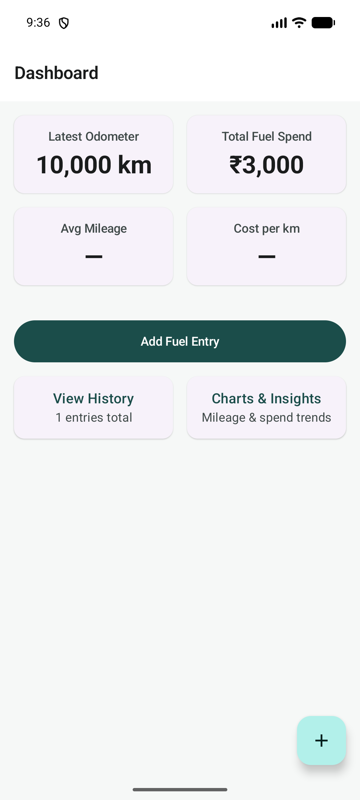</td>
    <td>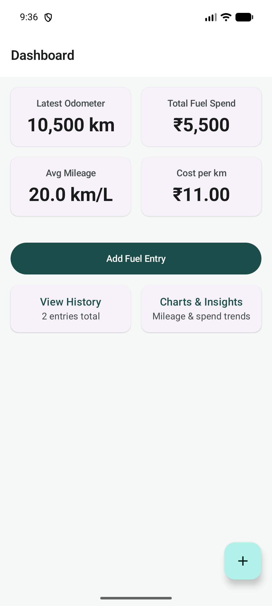</td>
  </tr>
  <tr>
    <td align="center"><b>After Entry 3</b><br/><i>Full metric grid</i></td>
    <td align="center"><b>After Edit</b><br/><i>Edited values reflected</i></td>
    <td align="center"><b>After Delete</b><br/><i>Metrics updated</i></td>
  </tr>
  <tr>
    <td></td>
    <td>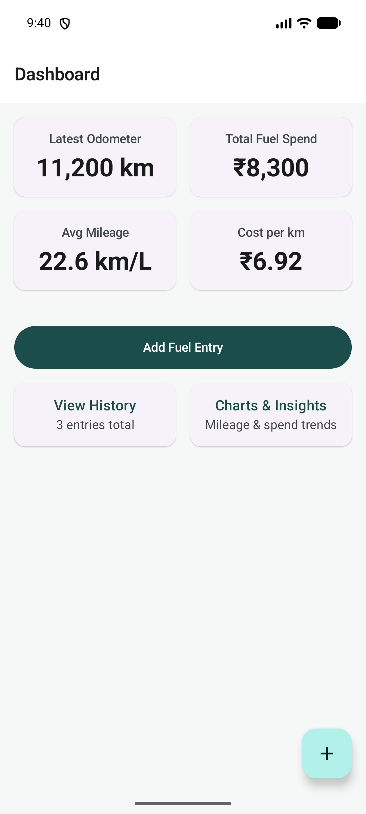</td>
    <td>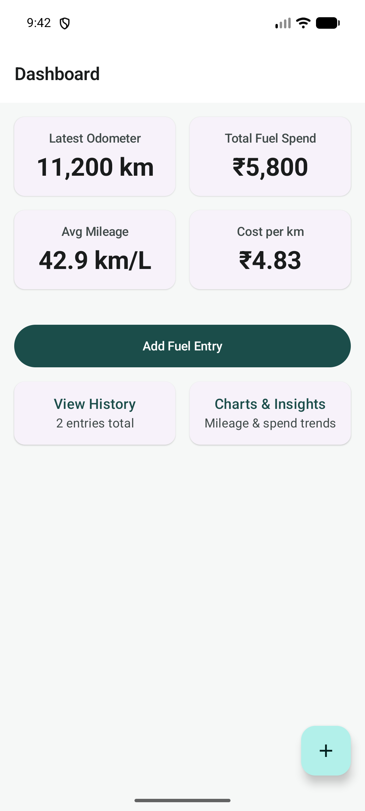</td>
  </tr>
  <tr>
    <td align="center"><b>Empty Final</b><br/><i>All entries deleted</i></td>
    <td></td>
    <td></td>
  </tr>
  <tr>
    <td>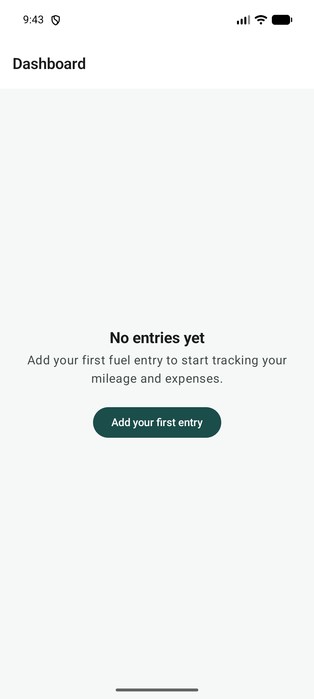</td>
    <td></td>
    <td></td>
  </tr>
</table>

### 12.2 Add / Edit Entry

<table>
  <tr>
    <td align="center"><b>Add Entry Form</b><br/><i>Blank form with date picker</i></td>
    <td align="center"><b>Form Filled</b><br/><i>First entry data with category</i></td>
    <td align="center"><b>Edit Mode</b><br/><i>Existing entry loaded</i></td>
  </tr>
  <tr>
    <td></td>
    <td>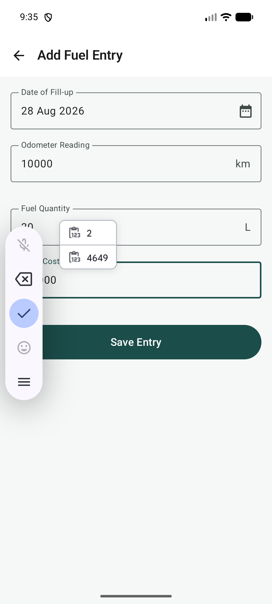</td>
    <td>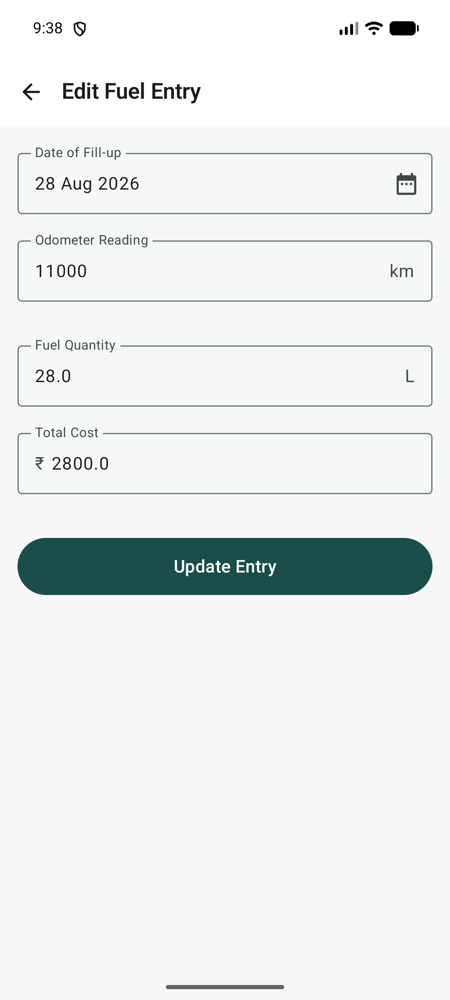</td>
  </tr>
  <tr>
    <td align="center"><b>Odometer Changed</b><br/><i>Modified odometer</i></td>
    <td align="center"><b>Odometer Corrected</b><br/><i>After validation feedback</i></td>
    <td></td>
  </tr>
  <tr>
    <td>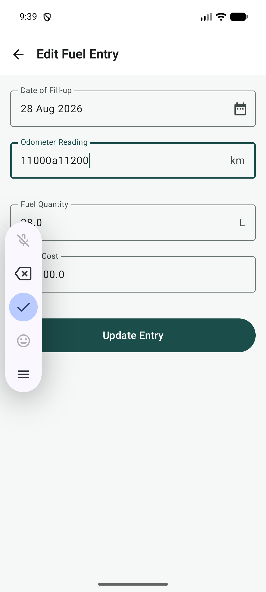</td>
    <td>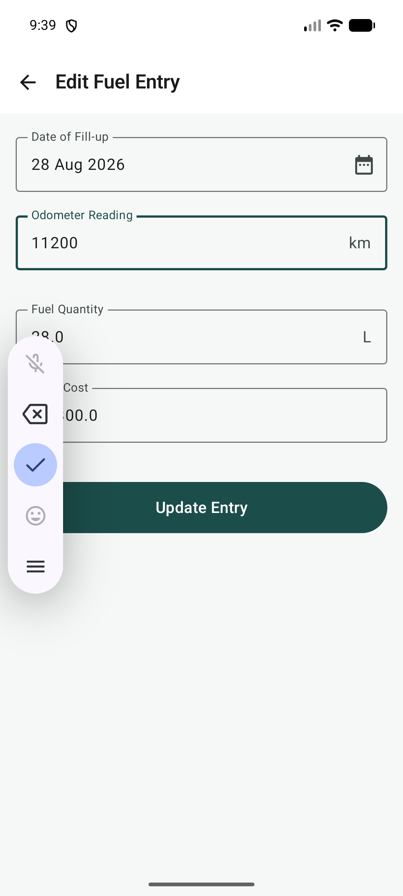</td>
    <td></td>
  </tr>
</table>

### 12.3 Fuel History

<table>
  <tr>
    <td align="center"><b>History (3 Entries)</b><br/><i>Category chips and mileage badges</i></td>
    <td align="center"><b>After Edit</b><br/><i>Edited entry reflected</i></td>
    <td align="center"><b>After Delete</b><br/><i>Entry removed</i></td>
  </tr>
  <tr>
    <td></td>
    <td>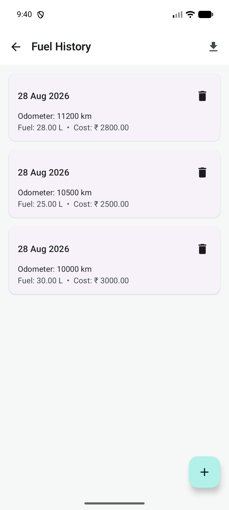</td>
    <td>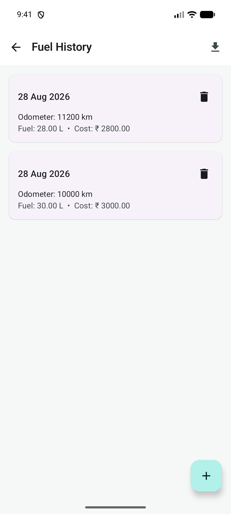</td>
  </tr>
  <tr>
    <td align="center"><b>Empty History</b><br/><i>All entries removed</i></td>
    <td></td>
    <td></td>
  </tr>
  <tr>
    <td>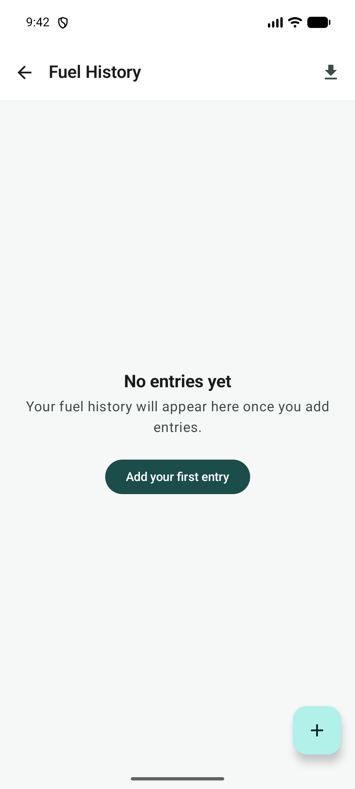</td>
    <td></td>
    <td></td>
  </tr>
</table>

### 12.4 Charts & Insights

<table>
  <tr>
    <td align="center"><b>Charts (3 Entries)</b><br/><i>Mileage trend + monthly spend</i></td>
    <td align="center"><b>After Delete</b><br/><i>Charts updated</i></td>
  </tr>
  <tr>
    <td></td>
    <td>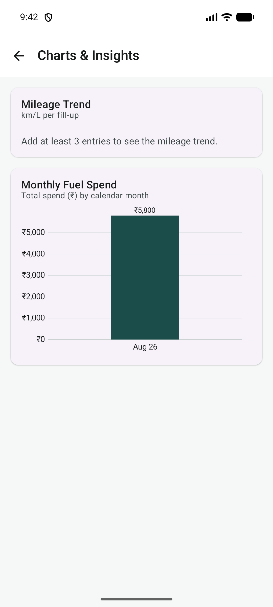</td>
  </tr>
</table>

### 12.5 Delete Confirmation

<table>
  <tr>
    <td align="center"><b>Confirmation Dialog</b><br/><i>Before deleting a fuel entry</i></td>
  </tr>
  <tr>
    <td></td>
  </tr>
</table>

### 12.6 UI Dump Files (XML)

The `docs/screenshots/` directory also contains 19 XML UI hierarchy dumps used for automated testing and accessibility audits:

| File | Description |
|---|---|
| `ui_empty_dashboard.xml` | UI hierarchy of empty dashboard |
| `ui_add_entry.xml` | Add entry form structure |
| `ui_after_save1.xml` | UI state after first save |
| `ui_after_save2.xml` | UI state after second save |
| `ui_after_save3.xml` | UI state after third save |
| `ui_history.xml` | History screen structure |
| `ui_last_entry.xml` | Last entry details |
| `ui_verify_odometer.xml` | Odometer verification state |
| `ui_edit_form.xml` | Edit form structure |
| `ui_edit_changed.xml` | Edit form after modification |
| `ui_after_edit.xml` | UI state after edit |
| `ui_delete_dialog.xml` | Delete confirmation dialog |
| `ui_after_delete.xml` | UI state after deletion |
| `ui_dashboard_after_edit.xml` | Dashboard after edit |
| `ui_dashboard_after_delete.xml` | Dashboard after delete |
| `ui_charts.xml` | Charts screen structure |
| `ui_charts_after_delete.xml` | Charts after deletion |
| `ui_empty_history.xml` | Empty history state |
| `ui_history_delete.xml` | History with delete action |

---

## Related Documentation

- [Product Requirements Document (PRD)](PRD_MileLog_Lite.md)
- [Sprint Execution Plan](Sprint_Plan_MileLog_Lite.md)
